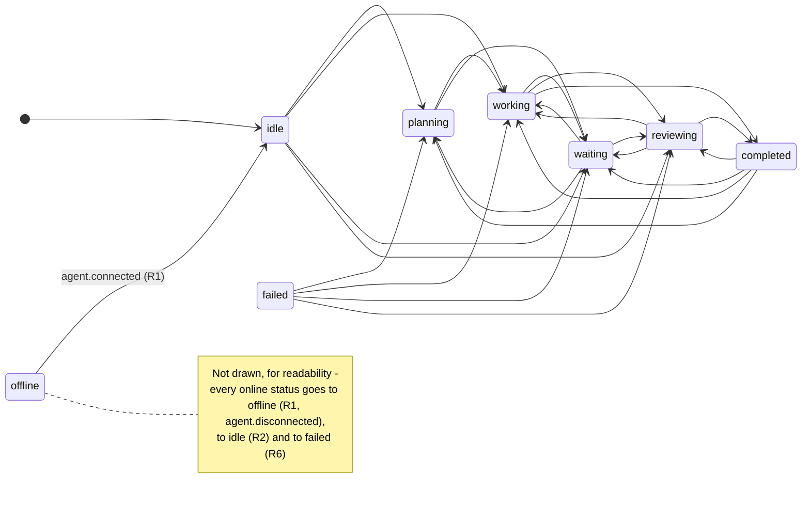
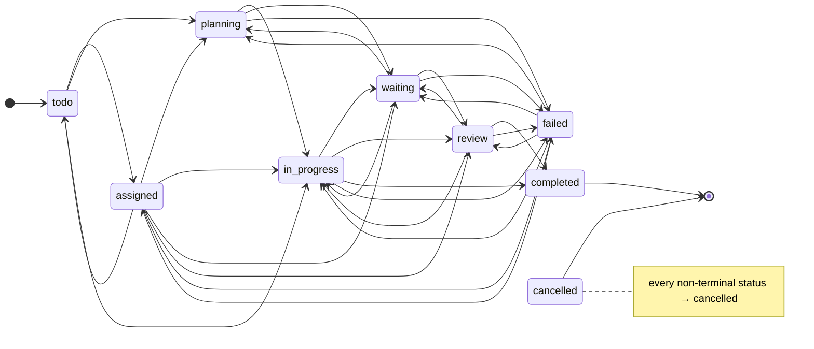

# AGENT STATE MACHINE — AI Virtual Office MVP

Owner: architect · Task: VO-000 · Date: 2026-10-03 · Status: design v1
Binding inputs: §3 of `ORIGINAL_REQUEST.md`, REQUIREMENTS §3.3/§3.4, REQ-003, REQ-010–013, REQ-042.
Decisions: ADR-015 (force), ADR-016 (revised table), ADR-017 (coupling rules).

The tables below are implemented **once** in `packages/shared/src/state/` (`agentStateMachine.ts`,
`taskStateMachine.ts`, `statusMapping.ts`) and used by the server for enforcement and by the web UI for
hints (REQ-010). This document and those files must stay identical; tests cover every cell.

> **Updated 2026-10-04 (TASK-010)** — checked against `packages/shared/src/state/*` and
> `apps/server/src/services/eventEffects.ts` / `taskRules.ts`: the transition tables, the agent → task mapping
> and the force rules match the code exactly. Added the implementation clarifications of ADR-024 and
> ADR-032 (marked *(TASK-010)*). No rule changed.

---

## 1. Agent statuses

| Status | Group | Meaning (§3) | Visual (§8) |
|---|---|---|---|
| `idle` | resting | No active task; agent is available | neutral, seated |
| `planning` | active | Analyzing a task; deciding next steps | thinking bubble |
| `working` | active | Actively executing a task | active monitor, typing, green/blue |
| `waiting` | active | Blocked or waiting for another agent/system | yellow, paused |
| `reviewing` | active | Reviewing code, documents, architecture or results | check icon, purple/blue |
| `completed` | resting | Latest task completed successfully | green check, short emphasis |
| `failed` | resting | Task or process failed | red alert |
| `offline` | offline | Agent is disconnected | gray, inactive workstation |

`ACTIVE = {planning, working, waiting, reviewing}` · `RESTING = {idle, completed, failed}` ·
`ONLINE = all except offline`.

## 2. Transition rules (ADR-016)

- **R1** Any status → `offline` (disconnect can happen at any time). `offline` → `idle` only.
- **R2** Any online status → `idle` (reset / abandon).
- **R3** Resting (`idle`, `completed`, `failed`) → any active status (start new work).
- **R4** Between active statuses only the directed work flow:
  `planning → working | waiting`, `working → waiting | reviewing`,
  `waiting → planning | working | reviewing`, `reviewing → working | waiting`.
- **R5** `completed` only from `working` or `reviewing` (something must have been done).
- **R6** `failed` from every online status.
- **Same status** (`X → X`) is not a transition: accepted as a status no-op; other fields may update
  (except `PATCH /api/agents/:id/status`, where it is a full no-op, REQ-004).

### 2.1 Full table (✔ legal, ✘ illegal, – same status)

| from \ to | idle | planning | working | waiting | reviewing | completed | failed | offline |
|---|---|---|---|---|---|---|---|---|
| **idle** | – | ✔ R3 | ✔ R3 | ✔ R3 | ✔ R3 | ✘ R5 | ✔ R6 | ✔ R1 |
| **planning** | ✔ R2 | – | ✔ R4 | ✔ R4 | ✘ R4 | ✘ R5 | ✔ R6 | ✔ R1 |
| **working** | ✔ R2 | ✘ R4 | – | ✔ R4 | ✔ R4 | ✔ R5 | ✔ R6 | ✔ R1 |
| **waiting** | ✔ R2 | ✔ R4 | ✔ R4 | – | ✔ R4 | ✘ R5 | ✔ R6 | ✔ R1 |
| **reviewing** | ✔ R2 | ✘ R4 | ✔ R4 | ✔ R4 | – | ✔ R5 | ✔ R6 | ✔ R1 |
| **completed** | ✔ R2 | ✔ R3 | ✔ R3 | ✔ R3 | ✔ R3 | – | ✔ R6 | ✔ R1 |
| **failed** | ✔ R2 | ✔ R3 | ✔ R3 | ✔ R3 | ✔ R3 | ✘ R5 | – | ✔ R1 |
| **offline** | ✔ R1 | ✘ R1 | ✘ R1 | ✘ R1 | ✘ R1 | ✘ R1 | ✘ R1 | – |

43 legal transitions, 13 illegal. Change vs REQUIREMENTS v1 (ADR-016): added `idle→waiting`,
`idle→reviewing`, `idle→failed`, `completed→waiting`, `completed→reviewing`, `completed→failed`,
`failed→waiting`, `failed→reviewing`.

Owner examples (§3), all legal: `idle→planning`, `planning→working`, `working→waiting`,
`waiting→working`, `working→reviewing`, `reviewing→completed`, `working→failed`, `failed→planning`,
`completed→idle`. Plus `idle→working` (§32 key scenario).

### 2.2 Every illegal transition and why

| Illegal | Reason | Legal path instead |
|---|---|---|
| `idle → completed` | nothing was done (R5) | `idle → working → completed` |
| `planning → reviewing` | review needs a result to review (R4) | `planning → working → reviewing` |
| `planning → completed` | nothing executed (R5) | `planning → working → completed` |
| `working → planning` | re-planning mid-work is modelled as waiting (R4) | `working → waiting → planning` |
| `waiting → completed` | must resume work or review first (R5) | `waiting → working/reviewing → completed` |
| `reviewing → planning` | review outcome is rework or waiting (R4) | `reviewing → waiting → planning` |
| `failed → completed` | a failure cannot become a success without new work (R5) | `failed → working → completed` |
| `offline → planning/working/waiting/reviewing/completed/failed` (6) | must reconnect first (R1) | `agent.connected` (`offline → idle`), then any |

Phase 2 note (REQUIREMENTS Q-2): real producers may report out of order; a possible "accept and flag"
mode is a Phase 2 decision. Phase 1 is strict.

## 3. Diagram

(Edges `X → offline`, `X → idle` and `X → failed` for every online X are summarized by the note to keep
the diagram readable; the table in §2.1 is authoritative.)

## 4. Side effects of an accepted agent event

Applied by the pure `decideEvent` (ADR-008) in this order. `S` = current status, `T` = resulting status
(explicit `status` ?? implied by the event type ?? `S`), `now` = server time.

1. **Legality** — if `S ≠ T` and `S → T` is illegal and not forced → reject 409 `ILLEGAL_TRANSITION`
   `{entity:"agent", id, from:S, to:T}`.
2. **Status effects** (only when `S ≠ T`):
   - `status = T`; `currentAction = event.action ?? null` (a status change never keeps a stale action).
   - `T ∈ ACTIVE` and `S ∉ ACTIVE` → `startedAt = now`. Between active statuses `startedAt` is kept.
   - `T = idle` → `taskId = null`, `currentTask = null`, `currentAction = null`, `progress = 0`,
     `startedAt = null`; `currentProject` kept (A-05).
   - `T = offline` → `online = false`, `startedAt = null`, `currentAction = null`; task/project/progress
     kept as last-known context (shown grayed).
   - `S = offline` (so `T = idle`) → `online = true`.
   - `T ∈ {completed, failed}` → `startedAt` kept (shows when the finished work started; running duration
     stops because the status is not active).
3. **Task binding** (ADR-017) — applies only when `T ∉ {idle, offline}` and the event is not
   `agent.task.assigned` without an explicit `status`. Then: if the event has a `taskId` →
   `taskId = event.taskId`, `currentTask = task.title ?? event.taskId`,
   `currentProject = task.project ?? resolved event project`; else if the event has a `project` →
   `currentProject = project`. *(TASK-010, ADR-032 §3)* An unknown `taskId` without a project keeps the
   agent's `currentProject`. (Binding happens for non-assignees too; only the *task row* is protected by
   the ownership rule, EVENT_SYSTEM.md §5.2.)
4. **Progress** (skip when `T = idle`): `event.progress` given → `progress = event.progress`; else if the
   bound `taskId` changed → `progress = task.progress ?? 0`.
5. **Completion** — `T = completed`, `S ≠ completed`, `taskId ≠ null` → `progress = 100`.
6. **Common** — `lastActivityAt = now`; `event.message` → `lastMessage`; `event.action` (when no status
   change happened and `T ∉ {idle, offline}`) → `currentAction`; `version += 1`.

Invariants (asserted in tests): `online = (status ≠ offline)`; `status = idle ⇒ taskId = currentTask =
currentAction = startedAt = null ∧ progress = 0`; `status ∈ ACTIVE ⇒ startedAt ≠ null`;
`0 ≤ progress ≤ 100`.

`agent.connected` on an online agent and `agent.disconnected` on an offline agent are accepted with
status unchanged (only step 6 applies). `system.*` events never change agents.

## 5. Task state machine

### 5.1 Statuses

| Status | Meaning | Group |
|---|---|---|
| `todo` | created, not assigned | open |
| `assigned` | has an assignee, not started | active (A-06) |
| `planning` | assignee is planning it | active |
| `in_progress` | being executed | active |
| `waiting` | blocked (`blockedBy`) or waiting on another agent/system | active |
| `review` | under review | active |
| `completed` | done (terminal) | done |
| `failed` | failed; may be retried | open |
| `cancelled` | dropped (terminal) | done |

"Active Tasks" metric = `assigned, planning, in_progress, waiting, review`; "Completed Tasks" =
`completed` (REQ-063).

### 5.2 Legal transitions

| from | legal targets |
|---|---|
| `todo` | `assigned`, `planning`, `in_progress`, `cancelled` |
| `assigned` | `todo`, `planning`, `in_progress`, `waiting`, `review` *(added, ADR-016)*, `failed`, `cancelled` |
| `planning` | `in_progress`, `waiting`, `failed`, `cancelled` |
| `in_progress` | `waiting`, `review`, `completed`, `failed`, `cancelled` |
| `waiting` | `planning`, `in_progress`, `review`, `failed`, `cancelled` |
| `review` | `in_progress`, `waiting`, `completed`, `failed`, `cancelled` |
| `failed` | `assigned`, `planning`, `in_progress`, `waiting` *(added)*, `review` *(added)*, `cancelled` |
| `completed`, `cancelled` | none — terminal (only `force`, ADR-015) |

Everything not listed is illegal (e.g. `todo → completed`, `planning → review`, `in_progress →
planning`, `waiting → completed`, `failed → completed`, any move out of a terminal status).
Like the agent machine, a failed task may re-enter any active status except via completion (retry).
Same status is a no-op.

**Implicit assignment** (ADR-017): a `todo` task that is, or becomes in the same operation, assigned is
validated from `assigned` (e.g. a claimed `todo` task may go to `waiting` or `review`). Applies to agent
events and to `PATCH /api/tasks/:id` that sets `assignedAgentId` and `status` together. The 409 `from`
field reports the stored status (`todo`).

*(TASK-010, ADR-024)* `PATCH /api/tasks/:id` **without** `status`: setting an assignee on a `todo` task moves
it to `assigned`; clearing the assignee of an `assigned` task moves it back to `todo`; otherwise the status is
unchanged. `POST /api/tasks` creates tasks only as `todo` (no assignee) or `assigned` (with assignee).
*(ADR-032 §5)* A task created by `agent.task.assigned` with an explicit `status` is created directly in the
mapped status.

### 5.3 Task side effects

- First entry into `in_progress` → `startedAt = now` (if null).
- Entry into `completed` → `completedAt = now`, `progress = 100`. Leaving `completed` (force only) →
  `completedAt = null`.
- Terminal tasks: `progress` cannot change (409 `ILLEGAL_TRANSITION`, `from = to = status`); `title`,
  `description`, `priority`, `blockedBy`, `metadata` edits via PATCH remain allowed.
- Every write: `version += 1`.

## 6. Agent status → task status mapping (REQ-042)

| Agent status entered | Task status |
|---|---|
| `planning` | `planning` |
| `working` | `in_progress` |
| `waiting` | `waiting` |
| `reviewing` | `review` |
| `completed` | `completed` |
| `failed` | `failed` |
| `idle`, `offline` | unchanged |

Applied when an accepted generic agent event (`agent.status.changed`, `agent.activity`,
`agent.message`, or `agent.task.assigned` with explicit status) **changes** the agent's status and carries
the `taskId` of an existing task owned by that agent or unassigned (then claimed). Lifecycle events
(`agent.task.started/completed/failed`) set the task status by their type instead (EVENT_SYSTEM.md §4).
If the mapped task transition is illegal, the **whole event** is rejected (409, `entity:"task"`).

**Consistency property** (ADR-016, property-tested in shared): let the *mirror* task status of agent
status `S` be `map(S)` for `S ∈ ACTIVE`; for resting `S` it is `assigned` (a newly assigned task) and, for
`S = failed`, also `failed` (retrying the failed task). Then for every agent transition `S → T` with `T`
mapped (§6, `T ≠ S`) and every mirror status `m` of `S`: `S → T` is legal **iff** `m → map(T)` is legal
(with implicit assignment for `todo`). Only exception, by design: a `completed` task (terminal) cannot be
restarted — a completed agent starts *new* work on another task. Hence an agent that keeps its task in sync
is never blocked by the task machine, and vice versa.

## 7. How events trigger transitions

| Event type | Implied agent status `T` | Task effect (owner/claimable only) |
|---|---|---|
| `agent.connected` | `idle` if `offline`, else unchanged | — |
| `agent.disconnected` | `offline` | — |
| `agent.status.changed` | `status` (required) | mapping §6 if status changed |
| `agent.activity` | `status` ?? unchanged | mapping §6 if status changed |
| `agent.message` | `status` ?? unchanged | mapping §6 if status changed |
| `agent.task.assigned` | `status` ?? unchanged | create if unknown; assignee = agent; → `assigned`; then mapping §6 if explicit status changed the agent |
| `agent.task.started` | `status` ?? `working` | → `in_progress` |
| `agent.task.progress` | `status` ?? unchanged | `progress = value` |
| `agent.task.completed` | `status` ?? `completed` | → `completed` |
| `agent.task.failed` | `status` ?? `failed` | → `failed` |
| `system.info/warning/error` | — (no agent change) | — |

`status` is not accepted on `agent.connected`, `agent.disconnected` and `system.*` (400). Details,
required fields and error codes: `docs/EVENT_SYSTEM.md`.

## 8. Force semantics (ADR-015)

- Available only on `PATCH /api/agents/:id/status` and `PATCH /api/tasks/:id` via `force: true`. Never on
  `POST /api/events` or demo.
- Skips **only** transition legality (agent and the coupled task, including terminal tasks). Schema,
  unknown ids/projects, field limits and ownership rules still apply.
- Side effects of the target status still apply (§4, §5.3).
- The stored event has `forced: true`; log `warn` `forced_transition {entity, id, from, to}`.
- A forced request whose transition would have been legal anyway is stored with `forced: false`.
