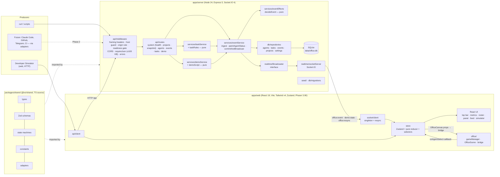
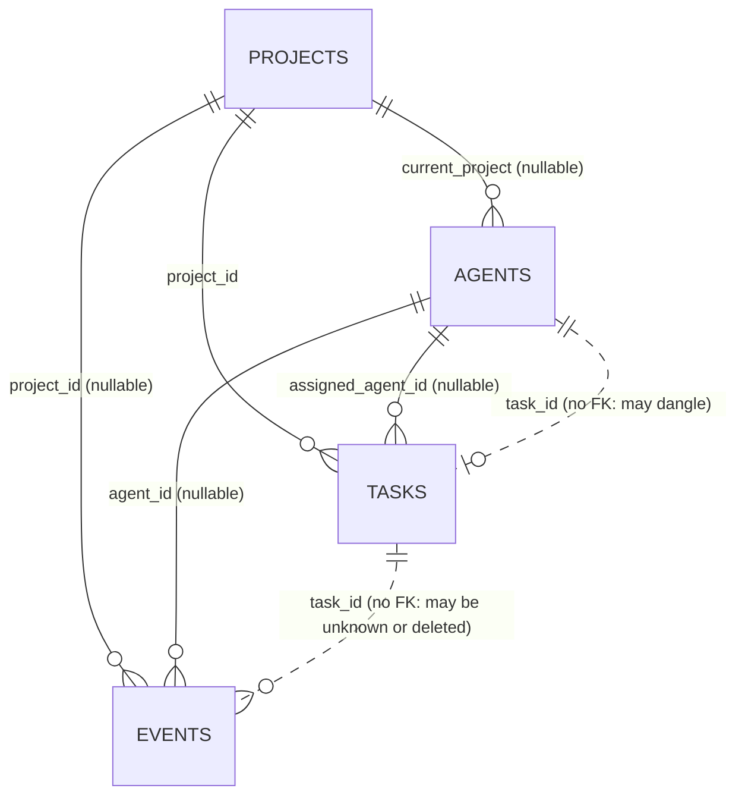

# ARCHITECTURE — AI Virtual Office MVP (Phase 1)

Owner: architect · Task: VO-000 · Date: 2026-10-03 · Status: design v1
Inputs: `docs/ORIGINAL_REQUEST.md` (§N, binding), `docs/PM_BRIEF.md` (PM-N), `docs/REQUIREMENTS.md`
(REQ-/NFR-/A-), `docs/PROJECT.md`. Decisions: `docs/DECISIONS.md` (ADR-NNN). Detailed designs:
`docs/EVENT_SYSTEM.md`, `docs/AGENT_STATE_MACHINE.md`. UX: `docs/UX.md` (ui-ux-designer). Exact REST/Socket
contracts: `docs/API_CONTRACTS.md` (tech-lead).

> **Updated 2026-10-04 (TASK-010)** — aligned with the implemented Phase 1 code and ADR-021…037: `{ data }`
> response envelope (ADR-021), Origin rule and readiness gate in the middleware chain (ADR-035/037),
> listen-first boot, snapshot `lastSeq` watermark, actual folder structure, dev launcher (ADR-036), event
> retention deferred (ADR-027, BL-001), Host guard implemented (ADR-027), `.env` parsing (ADR-032). §1 still
> describes the greenfield starting point. Edited spots are marked *(TASK-010)*.

---

## 1. Context

**Current system.** Greenfield. The repository (`Virtual Office MVP/`, branch `master`, no commits) contains
only `docs/` (ORIGINAL_REQUEST, PM_BRIEF, PROJECT, REQUIREMENTS) and `tasks/ACTIVE.md`. No code,
manifests, DB or deployment config exist. Environment: Windows 11, Node 24.12.0, npm 11.6.2; `node:sqlite`
verified (ADR-003).

**What Phase 1 adds.** A local, single-operator, monitoring-only system: a Node/Express/Socket.IO server
with a SQLite store and one event pipeline; a React + Phaser web client; a shared TypeScript package with
the domain contract (types, Zod schemas, state machines, constants, adapters). It must be shaped so that
Phase 2+ producers (Claude Code, GitHub, Telegram, CI, …) plug into the same pipeline (§18, §34).

**Architectural drivers.**

| Driver | Source | Consequence |
|---|---|---|
| All state changes through one backend pipeline | §10, §15, PM-7, REQ-022/050 | `EventService` is the only writer of agent/task state; UI is a projection |
| Producer-agnostic | §18, §19, REQ-130 | canonical envelope + adapters; `source` field |
| Atomic, ordered, no partial effects | REQ-022, REQ-029 | synchronous transaction + broadcast after commit (ADR-008) |
| Real-time < 1 s, resilient reconnect | NFR-001, REQ-052/053 | versioned entities, snapshot resync (ADR-010) |
| No native builds, offline, Windows | NFR-010, PM-2 | `node:sqlite`, bundled fonts/assets, no CDN |
| Simplicity | §5 "do not over-engineer" | 3 workspaces, no ORM, no message broker, no rooms |

## 2. Components



### 2.1 Responsibilities and boundaries

| Component | Responsibility | Must not |
|---|---|---|
| `@vo/shared` | Domain types; Zod input schemas; agent/task state machines + status mapping; constants (statuses, event types, actions, rooms, limits, error codes); `eventMatchesProject`; seed reference data (agents, projects); producer adapters | import Node or DOM APIs; contain I/O |
| `api/` (routes + middleware) | HTTP parsing, query/body validation via shared schemas, mapping to services, error envelope | contain business rules or SQL |
| `services/eventService` | The single write path: transaction, reference resolution, call `decideEvent`, persist, broadcast after commit | `await` inside a transaction; broadcast before commit |
| `services/eventEffects` | Pure rules: target status, legality, side effects, task coupling, severity, project derivation | touch DB, clock (time is passed in), sockets |
| `services/taskService` | Task create/patch rules (id generation `<PREFIX>-<n>`, `blockedBy` validation) via `commitAndBroadcast` | bypass the event log |
| `services/demoService` + `demoScript` | Timer, start/stop/recover, snapshot + restore; storyline generation (pure) | write rows except through `EventService` (ticks) or `restoreDemoSnapshot` (restore, same transaction helper) |
| `services/retentionService` | *(TASK-010)* **Not implemented in Phase 1** — deferred to BL-001 (ADR-027). Design: count-cap pruning (ADR-014) | prune events newer than `demo.startSeq` |
| `db/` | Connection + pragmas, migrations, repositories, row mappers | leak SQL outside repositories |
| `realtime/` | Socket.IO server (CORS, logging, `onAny` debug; `allowRequest` = Host guard + Origin rule + readiness, ADR-035), `createIoBroadcaster` implementing `Broadcaster` *(TASK-010)* | accept client commands |
| `seed/` | Seed-if-empty, explicit reset CLI (dev DB only) | run reset implicitly |
| `web/api` | `fetch` wrapper (timeout, JSON, `ApiError` from envelope) | swallow errors |
| `web/socket` | One `io()` instance, listeners attached once, connection status, resync orchestration | register listeners in React effects |
| `web/store` | Zustand state; `hydrate(snapshot)` and `applyOfficeEvent(payload)` are the **only** mutators of agents/tasks; *(TASK-010, ADR-033)* plus `applyDemoState` and the feed loader (`setFeedProject`/`hydrateFeed`/`feedFailed`), all fed only by server data | be mutated by simulator directly |
| `web/office` | Phaser lifecycle (single instance), scene rendering, visual mapping; seam = `OfficeCanvas` props (ADR-025) | import React shell modules or own business state |
| `web/*` features | Presentational/feature components per UX.md | compute state transitions locally (use shared machine only for hints) |

## 3. Folder structure (as implemented)

*(TASK-010)* Replaced the v1 target tree with the implemented layout. Differences from v1: no `retentionService`
(BL-001); routes grouped into `system.ts` (health, projects, snapshot); `originGuard.ts` added (ADR-037); web
`theme/` dropped (tokens in `@vo/shared` + `styles/index.css`, ADR-025); `office/layout.ts` is
`office/officeLayout.ts` (ADR-033); `scripts/dev.mjs` launcher (ADR-036).

```
Virtual Office MVP/
├─ package.json              # workspaces; scripts dev, dev:server, dev:web, build, start, lint, typecheck, test,
│                            # format, format:check, db:reset, verify, smoke
├─ package-lock.json  tsconfig.base.json  eslint.config.js  .prettierrc.json  .prettierignore
├─ .editorconfig  .gitattributes (LF)  .gitignore  .env.example  README.md
├─ data/                     # office.db (+ -wal/-shm) — gitignored, created at runtime; .gitkeep
├─ scripts/                  # dev.mjs (dev launcher) verify.mjs smoke-live.mjs
├─ docs/  tasks/
├─ packages/shared/          # @vo/shared, "type":"module", exports → ./src/index.ts (TS source, no build)
│  └─ src/
│     ├─ index.ts
│     ├─ constants/          # statuses eventTypes actions rooms limits errorCodes labels palette officeLayout app
│     ├─ types/              # json project agent task event api (snapshot, envelopes, errors) socket demo
│     ├─ schemas/            # common fields issues (toValidationIssues) event agent task query demo
│     ├─ state/              # agentStateMachine taskStateMachine statusMapping
│     ├─ filters/            # projectFilters (eventMatchesProject, agentMatchesProject, taskMatchesProject)
│     ├─ reference/          # agents (15) projects (4)
│     └─ adapters/           # types claudeCode index (PRODUCER_ADAPTERS — unwired in Phase 1)
│     (tests colocated: *.test.ts)
├─ apps/server/              # @vo/server; deps: express, socket.io, cors, zod, tsx, @vo/shared
│  ├─ src/
│  │  ├─ index.ts            # listen-first boot (§9) + shutdown handlers
│  │  ├─ app.ts              # createServerApp(options) → { app, httpServer, io, services, markReady, close }
│  │  ├─ config.ts  logger.ts  errors.ts
│  │  ├─ db/                 # connection.ts migrations/ (index, 001_init) mappers.ts types.ts testing.ts
│  │  │                      # repositories/ (agent task event project settings + statements, index)
│  │  ├─ services/           # eventService eventEffects (pure) taskService taskRules (pure) demoService
│  │  │                      # demoScript (pure) snapshotService projectResolver testHarness (tests only)
│  │  ├─ realtime/           # broadcaster.ts (interface, Noop, Recording) socketServer.ts
│  │  ├─ api/
│  │  │  ├─ router.ts        # CORS, routes, /api 404, error handler
│  │  │  ├─ routes/          # system.ts (health, projects, snapshot) agents.ts events.ts tasks.ts demo.ts context.ts
│  │  │  ├─ middleware/      # hostGuard.ts originGuard.ts requireJson.ts errorHandler.ts notFound.ts
│  │  │  └─ static.ts        # SERVE_WEB: apps/web/dist + SPA fallback
│  │  └─ seed/               # seed.ts (seedIfEmpty) seedData.ts reset.ts (CLI)
│  │  (unit tests colocated: *.test.ts)
│  └─ test/                  # api/*.test.ts (Supertest), socket*, demo*, boot/startup/shutdown, security, helpers/
└─ apps/web/                 # @vo/web; deps: react, react-dom, react-router, zustand, phaser, socket.io-client,
   │                         # lucide-react, @fontsource-variable/inter, zod, @vo/shared
   ├─ index.html  vite.config.ts (port 5173, proxy /api + /socket.io → 127.0.0.1:4000, cors:false, framing headers)
   ├─ vitest.config.ts (jsdom)  test/ (setup, smoke)
   └─ src/
      ├─ main.tsx  App.tsx  AppErrorFallback.tsx  copy.ts (all UI copy)
      ├─ styles/             # index.css (@import "tailwindcss"; @theme tokens = shared palette)
      ├─ api/                # client.ts (fetch, timeout, ApiError) endpoints.ts health.ts
      ├─ socket/             # socket.ts (singleton, listeners once) connection.ts (status) sync.ts (buffered resync)
      ├─ store/              # store.ts reducer.ts (pure) selectors.ts (metrics, filtering)
      ├─ office/             # OfficeCanvas.tsx (lazy seam) gameManager.ts bridge.ts OfficeScene.ts runtime.ts
      │                      # objects/AgentDesk.ts officeLayout.ts visuals.ts (pure) palette.ts textures.ts
      ├─ components/         # Avatar Button Controls ErrorBoundary Feedback ProgressBar StatusChip Tags
      ├─ layout/             # TopBar ProjectSelector StatusPills DemoControls SystemBanners Toasts
      ├─ dashboard/          # MetricsRow OfficeCard officeSizing
      ├─ agents/             # AgentRoster AgentCard AgentDetailPanel useAgentData logLine tabs/ (Activity Tasks Logs SampleTabs)
      ├─ activity/           # ActivityFeed FeedRow EventLabelView eventLabel
      ├─ simulator/          # SimulatorDock simulatorLogic (pure)
      ├─ mocks/              # sampleWorkspace.ts (Files/Git sample data, labelled)
      ├─ hooks/  lib/        # useNow useViewport useReducedMotion useSystemStatus useChangeFlash · time url storage runtime
      ├─ pages/              # OfficePage NotFoundPage
      └─ testing/            # fakes fixtures renderApp (tests only)
      (tests colocated: *.test.ts(x))
```

The owner's illustrative `apps/server/src/agents|events|socket|types` folders map to
`services/` + `api/routes/` + `realtime/` + `@vo/shared/types` respectively (ADR-001).

## 4. Data flow

### 4.1 Main write path (event → UI)

```
Producer ──POST /api/events──▶ middleware (framing headers, host guard, origin rule, readiness gate,
                                 CORS, requireJson: Content-Type + no Content-Encoding + JSON ≤100 KB)
  ▶ EventService.ingest: Zod parse (shared schema)
  ▶ BEGIN IMMEDIATE
      resolve agent / project / task  ─ 422/404
      decideEvent (pure, shared state machines) ─ 409
      INSERT event (seq,id,createdAt) · UPDATE agent (version+1) · INSERT/UPDATE task (version+1)
    COMMIT                                 (any throw → ROLLBACK, nothing broadcast)
  ▶ Broadcaster.officeEvent({event, agent, task})  ── Socket.IO `office:event` ──▶ every client
  ▶ HTTP 201 { data: {event, agent, task} }   (socket payload = `data`, ADR-021)
Client: socket listener → store.applyOfficeEvent (version-gated, id-deduped)
  ▶ React re-renders (metrics, roster, detail panel, feed) via selectors
  ▶ OfficeCanvas props → bridge → OfficeScene (changed agents only, by version) → desk visual/tween
```

Sequence diagram and step list: `docs/EVENT_SYSTEM.md` §6. Same path for `PATCH /api/agents/:id/status`
(→ `agent.status.changed`), Tasks API (→ `task.created/updated`), simulator (HTTP, `source:"simulator"`),
and demo ticks (in-process, `source:"demo"`).

### 4.2 Initial load and reconnect (ADR-010)

1. App boots → socket singleton connects (`io()` same origin; Vite proxies in dev). *(TASK-010, ADR-033)*
   In parallel, one HTTP snapshot fetch at startup, so the page loads even if the socket cannot connect;
   if the first connection never succeeds the status goes `Connecting…` → `Disconnected` after 30 s.
2. On `connect` (and on `office:resync`): store `syncing = true`; buffer `office:event` payloads; `GET
   /api/snapshot?project=<URL filter>` → `hydrate()` (wholesale replace) → replay buffer, *(TASK-010,
   ADR-035)* dropping payloads with `event.seq <= snapshot.lastSeq` (already in the snapshot) and re-applying
   a `demo:state` received during the fetch → `syncing = false`; bump `syncGeneration` so open panels
   (Activity/Tasks tabs) refetch.
3. On `disconnect` → status `reconnecting` (Socket.IO auto-reconnect with backoff 1 s → max 10 s,
   infinite attempts); after 30 s, browser offline, or a server-closed connection → `disconnected` while
   retrying continues; a "Reconnect" action forces an immediate attempt (thresholds per UX.md §11).
   Health is polled (`GET /api/health`, every 15 s, every 5 s while failing, and immediately on socket
   error) to distinguish
   "backend unavailable" from "socket only" (REQ-142/143).
4. Filter change → `GET /api/events?project=` replaces the feed list (entities are unaffected).

### 4.3 Demo flow (ADR-011)

`POST /api/demo/start` → transaction: persist `settings.demo = {active, intervalMs, startedAt, startSeq,
snapshot}` + `system.info` event → broadcast `office:event`, `demo:state` → timer → each tick
`nextDemoBeat` → `EventService.ingest(source:"demo")` (normal broadcasts). `POST /api/demo/stop` (or
graceful shutdown on SIGINT/SIGTERM/SIGHUP/SIGBREAK/IPC disconnect, or boot recovery) → `restoreDemoSnapshot`
transaction → broadcast `office:event` (summary), `demo:state`, `office:resync` → clients resync.
*(TASK-010)* Boot recovery runs after `listen` and before the readiness gate opens (listen-first boot,
ADR-035, §9). Restore keeps user-touched rows and never deletes a demo task still referenced by a kept agent
or task (ADR-034/035).

### 4.4 Read paths

`GET /api/agents|tasks|events|projects|snapshot` read repositories directly (no service logic beyond
filter resolution). Project filters resolve name/id (ADR-006). Lists cap at 500. *(TASK-010, ADR-035)* The
snapshot returns the newest 500 tasks plus every task bound to an agent, and `lastSeq` (highest stored `seq`).

### 4.5 Office (Phaser) update path

*(TASK-010, ADR-025)* Store change → React shell re-renders `OfficeCanvas` with props (`agents`,
`projectFilter`, `selectedAgentId`, `reducedMotion`, `paused`) → internal bridge →
scene compares `version` per agent → `AgentDesk.setAgent(agent)` updates label/indicator and switches the
status animation; filter change → dims non-matching desks (alpha); selection → highlight ring. Clicks →
`onAgentSelect(id)` prop → store `selectAgent` + URL `?agent=` → React opens the detail panel.

## 5. Data model



Tables (migration `001_init`; all timestamps UTC ISO TEXT; JSON as TEXT):

| Table | Columns | Constraints / indexes |
|---|---|---|
| `projects` | `id` TEXT PK, `name` TEXT, `task_prefix` TEXT, `sort_order` INT, `created_at` | `UNIQUE(name)`, `UNIQUE(task_prefix)` |
| `agents` | `id` TEXT PK, `code`, `name`, `role`, `short_role`, `avatar`, `department`, `room_id`, `desk_id`, `sort_order` INT, `status`, `current_project` FK→projects NULL, `current_task` TEXT NULL, `task_id` TEXT NULL, `progress` INT, `started_at` NULL, `last_activity_at` NULL, `current_action` NULL, `last_message` NULL, `online` INT 0/1, `metadata` TEXT JSON, `version` INT, `updated_at` | `UNIQUE(code)`, `UNIQUE(desk_id)`, `CHECK(status IN (…8))`, `CHECK(progress BETWEEN 0 AND 100)`, `CHECK(online IN (0,1))` |
| `tasks` | `id` TEXT PK, `title`, `description` NULL, `project_id` FK→projects NOT NULL, `assigned_agent_id` FK→agents NULL, `status`, `priority`, `progress` INT, `created_at`, `started_at` NULL, `completed_at` NULL, `blocked_by` TEXT JSON array, `metadata` TEXT JSON, `version` INT, `updated_at` | `CHECK` on status (9), priority (4), progress; `INDEX(project_id, status)`, `INDEX(assigned_agent_id)` |
| `events` | `seq` INTEGER PK AUTOINCREMENT, `id` TEXT, `type`, `source`, `agent_id` FK→agents NULL, `project_id` FK→projects NULL, `task_id` TEXT NULL, `status` NULL, `action` NULL, `message` NULL, `severity`, `progress` INT NULL, `metadata` TEXT JSON, `occurred_at` NULL, `created_at`, `forced` INT 0/1 | `UNIQUE(id)`; `INDEX(project_id, seq)`, `INDEX(agent_id, seq)`, `INDEX(type, seq)`, `INDEX(task_id, seq)` *(TASK-010: in `001_init`)* |
| `settings` | `key` TEXT PK, `value` TEXT JSON, `updated_at` | holds `demo` (ADR-011) |

Notes: agents are never deleted (FKs safe); tasks are deleted only by demo restore (demo tasks), hence no
FK from `events.task_id`/`agents.task_id`. `blocked_by` ids are validated by `taskService`, stored as JSON
(no join table — no query needs it). Task id generation: `<PREFIX>-<max numeric suffix + 1>` computed
inside the creating transaction (seed: `SW-123…` → next `SW-126`); demo ids
`<PREFIX>-D<startSeq>-<cycle><a|b|c|d>` (e.g. `SW-D57-1a`, ADR-027 — *TASK-010*) do not participate.
`version` starts at 1.

Domain objects (camelCase, in `@vo/shared/types`): `Agent` (all §2 fields + `version`), `Task` (§14 fields
+ `version`, `updatedAt`), `OfficeEvent` (EVENT_SYSTEM.md §2.2), `Project {id, name, taskPrefix}`,
`DemoState`, `Snapshot`.

Seed (REQ-120–122): `seedIfEmpty` runs when `agents` is empty, in one transaction, from
`@vo/shared/reference` + `seed/seedData.ts`; historical events are inserted directly through the event
repository with timestamps spread over the past ~2 h and **seed states computed to be consistent** with
the final agent/task rows (seed is the only writer that bypasses `decideEvent`; a seed-consistency test
asserts invariants of ASM §4 and REQ-121). *(TASK-010)* The implemented seed writes 15 agents, 4 projects,
11 tasks and 44 events. `npm run db:reset` (dev only) deletes `data/office.db*` and reseeds; it refuses to
run while the server port is in use, for `:memory:`, or for a `DB_PATH` outside `data/`.

## 6. API surface (overview — exact contracts in `API_CONTRACTS.md`)

| Method & path | Purpose | Notes |
|---|---|---|
| `GET /api/health` | liveness + DB check | 200 / 503 (REQ-025) |
| `GET /api/projects` | 4 projects | REQ-026 |
| `GET /api/agents[?project]` · `GET /api/agents/:id` | agents | REQ-001/002 |
| `PATCH /api/agents/:id/status` | operator status change → `agent.status.changed` | `force?` (ADR-015) |
| `GET /api/events?project&agentId&taskId&type&source&limit&before` | history, newest first, `before` = `seq` cursor | feed predicate §8.3 of EVENT_SYSTEM; `page.nextBefore` |
| `POST /api/events` | producer ingest | 201 `{ data: {event, agent, task} }` |
| `GET /api/tasks?project&agentId&status` · `POST /api/tasks` · `PATCH /api/tasks/:id` | tasks | `force?` on PATCH |
| `GET /api/snapshot?project&eventsLimit` | **new**: consistent initial/resync state | ADR-010 |
| `GET /api/demo` · `POST /api/demo/start` · `POST /api/demo/stop` | **new**: demo control | idempotent; ADR-011 |

*(TASK-010, ADR-021)* Every 2xx body is `{ "data": <payload> }` (paged lists add `page: {limit,
nextBefore}`); errors are `{ "error": {code, message, details?} }`. The `data` of write responses has the
`OfficeEventPayload` shape `{event, agent, task}` (PATCH agent status: 200; POST events/tasks: 201;
same-status PATCH / unchanged task PATCH no-op: 200 with `event: null`). The socket `office:event` payload
equals that `data` (not the whole body). Socket messages: EVENT_SYSTEM §8.1.

## 7. Frontend architecture

- **Routing**: one main route `/` (`OfficePage`); URL query is the source of truth for
  `?project=<id>` (REQ-061) and `?agent=<id>` (open detail panel; unknown → "Agent not found", REQ-083).
  A tiny effect mirrors URL → store `ui` so the Phaser bridge can read it. Unknown routes → `NotFoundPage`.
- **Store** (Zustand, single store, slices): `agents` (by id + order), `tasks` (by id), `feed` (≤ 200,
  newest first, + id set), `projects`, `demo`, `connection {socket, api, syncing, lastSyncAt,
  serverTimeOffsetMs}`, `ui {projectFilter, selectedAgentId}`, `syncGeneration`. Mutators of domain data:
  `hydrate`, `applyOfficeEvent` only (pure reducer in `store/reducer.ts`, unit-tested); *(TASK-010,
  ADR-033)* plus `applyDemoState` and the feed loader for `GET /api/events?project=`, both fed only by server
  data. Agents/tasks are keyed in null-prototype records (ADR-037 SEC-4). Derived data (metrics per filter,
  roster ordering/dimming) are pure selectors in `store/selectors.ts`.
- **Writes** (simulator, demo toggle, any form): call `api/endpoints.ts`; on success pass the response
  payload to `applyOfficeEvent` (idempotent with the broadcast); on failure show `error.message`; never
  touch the store optimistically (REQ-104). Forms validate with the shared Zod schemas first.
- **Clock**: one shared 1 s ticker (`useNow()`) for the top-bar clock and running durations; durations use
  `useServerNow()`, corrected by the snapshot `serverTime` offset, to avoid client clock skew *(TASK-010:
  implemented)*.
- **Phaser** (ADR-012, seam per ADR-025): lazy `OfficeCanvas` (props only) → `gameManager.mountOffice(div, bridge)`; one game; scene
  diffs agents by `version`; `visuals.ts` maps `(status, recentlyCompleted, dimmed, selected,
  reducedMotion)` → visual spec (pure, tested); `completed` emphasis 2.5 s is a client-side visual timer
  only. World 1140 × 540 with rooms/desks from `@vo/shared` `OFFICE_ROOMS` (UX.md §5.2, canonical; seed
  `deskId`s `<roomId>-<n>` must match), used through `office/officeLayout.ts`; status/department colors
  and labels are defined once in `@vo/shared` (ADR-025) and repeated in the Tailwind `@theme` (a test
  asserts they match); canvas-only art colors live in `office/palette.ts` *(TASK-010)*.
- **Accessibility**: the roster is the keyboard/screen-reader equivalent of the canvas; the canvas has
  `role="img"` + `aria-label` summary; status always icon + text.
- **Mock tabs** *(TASK-010, ADR-022)*: Files/Git read from `mocks/sampleWorkspace.ts` with a permanent
  "Sample data — not connected (Phase 1)" label (REQ-082). Logs are derived from the agent's real stored
  events (`agents/logLine.ts`) with the notice "Derived from stored events — live log streaming arrives in
  Phase 2".

## 8. Technology stack

| Concern | Choice | Rejected alternatives (reason) |
|---|---|---|
| Monorepo | npm workspaces (ADR-001) | pnpm (extra global tool), Turborepo/Nx (over-engineering) |
| Language | TypeScript ~5.9 strict | TS 6/7 (typescript-eslint support, PM-5) |
| Server runtime | Node 24 + `tsx` loader (ADR-013) | ts-node (slow, ESM friction), compiled build (needs bundling shared) |
| HTTP | Express 5 | Fastify (fine, but owner named Express), Express 4 (no native async errors) |
| Real-time | Socket.IO 4 | raw `ws` (owner named Socket.IO; no reconnection/fallback built in), SSE (one-way OK but owner mandated Socket.IO) |
| Validation | Zod 4 (`z.strictObject`, discriminated unions) shared by server and web | Joi/Yup (no type inference parity), hand-written guards |
| DB | SQLite via `node:sqlite` (ADR-003) | Prisma, better-sqlite3, sql.js, Drizzle (see ADR-003) |
| Logging | in-house JSON logger (ADR-018) | pino, winston |
| Web build | Vite + `@vitejs/plugin-react` | CRA (dead), Next.js (SSR not needed) |
| Styling | Tailwind CSS v4 via `@tailwindcss/vite` + small custom component set | shadcn/ui (allowed by §4; its Radix deps and CLI generation add weight; custom primitives are enough — designer may adopt individual shadcn patterns) , CSS-in-JS |
| State | Zustand | Redux Toolkit (boilerplate), React Context (re-render cost), TanStack Query (socket-driven state fits a store better) |
| Routing | React Router (single route + query params) | none (needed for URL state/404), TanStack Router |
| Office rendering | Phaser 3.90 (§4) — vector Graphics + generated textures | Phaser 4 (PM-4, API churn), PixiJS (owner named Phaser), DOM/SVG office (weaker animation) |
| Icons / fonts | lucide-react; Inter via `@fontsource-variable/inter` (bundled) | CDN fonts (NFR-010) |
| Tests | Vitest (all workspaces), Supertest (HTTP), socket.io-client (propagation), Testing Library + jsdom (web) | Jest (slower ESM/TS setup), Playwright (OPTIONAL later for e2e) |
| Lint/format | ESLint 9 flat + typescript-eslint, Prettier | Biome (owner named ESLint/Prettier) |
| Dev orchestration | *(TASK-010, ADR-036)* root `npm run dev` = `node scripts/dev.mjs`: spawns the server (tsx, no `node --watch`; the launcher restarts it on real content changes in `apps/server/src` / `packages/shared/src`, ADR-036 addendum 3) and Vite directly, port pre-check, kills both process trees on any stop path | shell `&` (not portable to PowerShell); `concurrently` (used first; orphaned processes on Windows, CR-7) |

## 9. Cross-cutting concerns

| Concern | Design |
|---|---|
| **Auth / tenancy** | None in Phase 1 (A-12, ADR-019): single local operator; no users/tenants. Future: Phase 8 auth + producer tokens; Phase 10 tenant id on every table and Socket.IO rooms per tenant. Design keeps one `EventService` entry point where an auth context can be added. |
| **Network exposure** | Bind `127.0.0.1` (startup `warn` if not loopback); CORS allowlist `CORS_ORIGINS`; write endpoints require `application/json`; *(TASK-010)* Host-header allowlist implemented and REQUIRED (ADR-027, 403 `HOST_NOT_ALLOWED`); Origin rule on HTTP writes and the Socket.IO handshake — allowed when absent, in `CORS_ORIGINS` or same-origin, else 403 `ORIGIN_NOT_ALLOWED` / handshake refused (ADR-035/037); `X-Frame-Options: DENY` + `frame-ancestors 'none'` on every response; Vite dev/preview `cors: false`. Dev proxy targets `127.0.0.1:4000`. Details: `SECURITY.md`. |
| **Error handling** | `AppError` + one error middleware; envelope `{error:{code,message,details?}}`; codes in shared `ERROR_CODES` (ADR-020); `/api/*` JSON 404; no stack/SQL in responses. Client `ApiError` with `code` for UI messages; 10 s request timeout (REQ-140). |
| **Validation** | Shared Zod schemas for bodies and queries; strict objects; limits from shared `LIMITS` (body 100 KB, metadata 8 KB, message 2000, action 100, title 200, description 5000, list 500). Reference checks in services (422), legality in `decideEvent` (409). |
| **Logging** | JSON lines `{time, level, msg, …ctx}` (ADR-018). Logged: start/stop (host, port, db path), 4xx `warn` `{code, method, route}`, 5xx/DB `error`, `event_rejected` (code, type, agentId, source — no payload), `forced_transition`, socket `connect`/`disconnect` `{socketId, clients}`, demo start/stop/recover, `socket_rejected`, `request_failed`, `server_started`/`server_stopping`/`server_stopped` *(TASK-010: no retention prune in Phase 1)*. Not logged at info: successful GETs, accepted events. `LOG_LEVEL` env; tests `silent`. |
| **Transactions / consistency** | `withTransaction` + synchronous work (ADR-004/008); broadcast after commit; entity `version` for client ordering (ADR-010). |
| **Limits / rate limiting** | Body/field limits above; demo interval 2–10 s; feed cap 200 client-side; list max 500. No HTTP rate limiting in Phase 1 (loopback-only); BACKLOG for Phase 8/9. |
| **Event retention** | *(TASK-010)* **Deferred** (ADR-027, BL-001): the `events` table is unbounded in Phase 1. Design for later: count cap `EVENT_RETENTION_MAX` (default 100 000), prune at boot + every 1 000 events, never inside demo window (ADR-014). Required before Phase 2 producers (`SECURITY.md` §6). |
| **Caching** | Projects cached in memory (immutable); prepared statements cached; no HTTP caching (`Cache-Control: no-store` on `/api`). |
| **Performance** | Synchronous SQLite with indexes: ingest well under 10 ms locally; broadcast payload ~2–4 KB. Web: Phaser lazy chunk; scene updates only changed desks; tweens only for active statuses; game loop pauses when tab hidden (Phaser default). Targets NFR-001/002. |
| **Reliability** | WAL mode; *(TASK-010, ADR-035)* listen-first boot: config → open DB + migrate → listen (the port is the single-instance lock; `EADDRINUSE` exits before touching data) → seed if empty → demo recovery → ready; until ready `/api/*` answers 503 `Server is starting` and sockets are refused; graceful shutdown on SIGINT/SIGTERM/SIGHUP, SIGBREAK (Windows) and IPC `disconnect` (stop demo with restore → close io → close http → close db; forced exit after 5 s) — in dev the launcher stops the server through IPC, so this also runs there (ADR-036 addendum 3); only a hard kill of the launcher skips it, and boot recovery then restores the demo; boot recovery of demo; migrations transactional; server never crashes on bad input (all handlers behind error middleware; `process.on('uncaughtException')` logs `error` and exits non-zero rather than continuing in an unknown state). |
| **Time** | Server is the clock: `createdAt`, `lastActivityAt`, `startedAt` are server UTC; `decideEvent` receives `now` as a parameter (deterministic tests). UI shows local 24 h time (NFR-011). |
| **Security (output)** | React/Phaser render text only (no `dangerouslySetInnerHTML`, Phaser `Text` is not HTML); parameterized SQL only; no shell/file APIs (REQ-160). `metadata` stored inert. |
| **Configuration** | `config.ts` parses env once at boot (fail fast): `PORT=4000`, `HOST=127.0.0.1`, `DB_PATH=<repo>/data/office.db` (resolved from the repo root, not CWD), `LOG_LEVEL=info`, `CORS_ORIGINS`, `SERVE_WEB=false` (CLI `--serve-web`), `DEMO_DEFAULT_INTERVAL_MS=3000`. *(TASK-010, ADR-032)* Parsed by hand-written rules with `ConfigError` (no Zod in `config.ts`); `<repo>/.env` is read with `util.parseEnv` and merged **under** the real environment (`process.env` not mutated); blank values = unset; no dotenv dep; `EVENT_RETENTION_MAX` does not exist (ADR-027); `.env.example` committed. |
| **Scalability (future)** | Single process by design. Scale-out path: replace SQLite with Postgres behind the same repositories; `Broadcaster` → Socket.IO Redis adapter; ingest becomes async queue. None needed in Phase 1. |

## 10. External dependencies

None real in Phase 1. No third-party services, no API keys, no network at runtime (fonts/assets bundled).

| Integration | Status | Notes |
|---|---|---|
| Claude Code event format (§19) | **UNVERIFIED** | pure adapter + tests only (ADR-007, EVENT_SYSTEM §10) |
| Telegram, GitHub, Docker, CI/CD, browser/OpenAI agents | not started | ROADMAP Phases 2–7 |
| npm registry | install-time only | lockfile committed (when commits are authorized) |

## 11. Testing architecture (seams for QA)

| Layer | How | Key seams |
|---|---|---|
| Shared | Vitest unit: 8×8 agent table, task table, consistency property (ASM §6), schemas (each REQ-023 rule), adapter, `eventMatchesProject` | pure functions |
| Server rules | Vitest unit on `decideEvent`, `demoScript` with fixed `now` | pure, no DB |
| Server integration | *(TASK-010)* `createTestApp()` (`apps/server/test/helpers/testApp.ts`: `:memory:` DB, `RecordingBroadcaster`, logger `silent`, listens on `127.0.0.1:0`) around `createServerApp(options)` + Supertest; REQ-029 asserts no new rows and no broadcasts on every error code | DI of DB path, broadcaster, clock |
| Real-time | real `httpServer.listen(0)` + socket.io-client: broadcast after POST, none after rejection, demo restore → `office:resync` | ephemeral port |
| Demo | start → events → user event → stop → snapshot restored except touched; crash recovery = start, close without stop, re-open same DB file in a temp dir, boot | `settings` row |
| Web | Vitest + Testing Library + jsdom: reducer/selectors (pure), detail panel, simulator (payloads, no store mutation on failure), filter; `gameManager` mocked | mock `api/endpoints`, fake socket |
| E2E / §32 | manual or scripted live run by QA/devops (REQ-190/191); *(TASK-010)* `npm run smoke` (one-port server on a temp DB: HTTP, socket broadcast, Origin rules, restart persistence) and `npm run smoke -- --dev` (Vite proxy) | temp DB, free port |

## 12. Risks and mitigations

| ID | Risk | Likelihood / impact | Mitigation |
|---|---|---|---|
| R-1 | `node:sqlite` is experimental: API change / warning noise | low / medium | Node pinned (`engines >= 22.13`), repository layer isolates driver, `--disable-warning=ExperimentalWarning` in scripts |
| R-2 | Vitest/Vite fails to resolve `node:sqlite` (prefix-only builtin) | medium / high | **First scaffolding task must include a smoke test** importing `node:sqlite` in server Vitest (`environment: node`, `pool: 'forks'`); fallback: `server.deps.external`/`ssr.external` config |
| R-3 | Phaser + React StrictMode double mount → two games / leaked canvas | high if naive / medium | deferred-destroy `gameManager` (ADR-012) + test asserting one instance after mount/unmount/mount |
| R-4 | Blurry canvas text under camera zoom / HiDPI | medium / medium | `Scale.RESIZE` + zoom-to-fit + `Text.setResolution(dpr)`; vector Graphics; verify at 1366, 1920, 2560 widths |
| R-5 | Phaser bundle (~1 MB) slows first paint | medium / low | lazy chunk; dashboard renders first (NFR-002) |
| R-6 | Demo restore overwrites user changes or leaves debris | medium / high | restore driven by persisted snapshot + event-log touch detection (conservative: user wins); dedicated tests incl. crash recovery |
| R-7 | Duplicate socket listeners / feed rows after reconnects | medium / medium | module singleton, listeners attached once, id dedupe, version gating; reconnect test N times |
| R-8 | Windows script portability (env vars, `&`, paths) | high / medium | no inline env in npm scripts (CLI flags/`.env`), dev launcher `scripts/dev.mjs` *(TASK-010, ADR-036)*, `path.resolve` everywhere, DB path not CWD-relative |
| R-9 | `localhost` → `::1` vs server on `127.0.0.1` (proxy ECONNREFUSED) | medium / medium | proxy target `http://127.0.0.1:4000` explicitly |
| R-10 | Strict state machine rejects legitimate real-producer sequences in Phase 2 | medium / medium | revised rule-based table (ADR-016); force for operators; Q-2 "accept and flag" decision in Phase 2 |
| R-11 | Synchronous long transaction blocks event loop | low / low | transactions touch ≤ 3 rows; demo restore touches ≤ ~50 rows; retention prune (when added, BL-001) runs outside requests in batches |
| R-12 | Seed bypasses `decideEvent` and creates inconsistent state | medium / medium | seed-consistency test of invariants (§5) |
| R-13 | Docs drift from code (REQ-182) | medium / medium | state tables generated/asserted from shared code in tests; auditor check |

## 13. Extension points (future phases)

- **Phase 2 (Claude Code)**: `POST /api/ingest/:source` + adapter registry; producer tokens; optional
  idempotency key; possibly "accept and flag" for out-of-order states.
- **Phase 3 (handoff)**: tasks gain `handoffs`/dependency events; uses `blockedBy` + `agent.task.assigned`.
- **Phase 4/7 (Telegram, remote control)**: a separate *command* channel (client → server → agent) with
  auth and audit — explicitly not the event socket, which stays server→client.
- **Phase 5/6 (GitHub, terminal/browser)**: real Files/Git/Logs tabs fed by events with structured
  `metadata`; tabs keep their current component boundaries.
- **Phase 8–10**: auth, Postgres, Socket.IO rooms per tenant/project, Redis adapter, retention policies.

## 14. Additional recommendations (classified)

*(TASK-010)* Status after Phase 1 in brackets.

| Class | Item |
|---|---|
| REQUIRED | R-2 smoke test for `node:sqlite` under Vitest in the scaffolding task [done, ADR-029] |
| REQUIRED | `GET /api/snapshot` and the buffered resync algorithm (ADR-010) — needed for REQ-052/053 correctness [done; `lastSeq` watermark ADR-035] |
| REQUIRED | `version` on agents/tasks (ADR-010) [done] |
| REQUIRED | Demo control endpoints (`/api/demo*`) — REQ-110 needs some API; shape per ADR-011 [done, ADR-022] |
| REQUIRED | Seed-consistency test (R-12) [done] |
| RECOMMENDED | Host-header allowlist middleware (ADR-019) [done, made REQUIRED by ADR-027] |
| RECOMMENDED | Event retention cap (ADR-014) [deferred, BL-001] |
| RECOMMENDED | Simulator preselects the agent's current task/project (ADR-017 consequence) [done] |
| RECOMMENDED | Server-time offset for running durations; Logs tab derived from real events [both done] |
| RECOMMENDED | `source` filter on `GET /api/events` (e.g. hide demo) [done] |
| OPTIONAL | UI control for `force`; Playwright e2e for §32; client idempotency key; Socket.IO rooms [backlog: BL-002, BL-004, BL-005, BL-006] |
