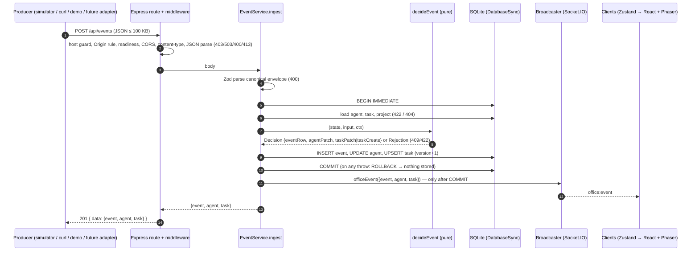

# EVENT SYSTEM — AI Virtual Office MVP

Owner: architect · Task: VO-000 · Date: 2026-10-03 · Status: design v1
Binding inputs: §10–§12, §18–§19 of `ORIGINAL_REQUEST.md`; REQ-020–029, REQ-040–042, REQ-050–053,
REQ-110–113, REQ-130–132. Decisions: ADR-005…011, ADR-014…017, ADR-020.
State rules referenced here are defined in `docs/AGENT_STATE_MACHINE.md` (ASM).
The tech lead turns this design into exact contracts in `docs/API_CONTRACTS.md`.

> **Updated 2026-10-04 (TASK-010)** — aligned with the implemented code and ADR-021…037: responses are
> `{ data: … }` and the socket payload equals `data` (ADR-021); middleware adds the Origin rule and the
> readiness gate (ADR-035/037); `PATCH /api/agents/:id/status` accepts `source`/`action` (ADR-022); snapshot
> `lastSeq` watermark (ADR-035); demo task ids and restore safety (ADR-027/034/035); event retention deferred
> (ADR-027, BL-001). Edited spots are marked *(TASK-010)*.

---

## 1. Principles

1. **One pipeline.** Every state change — external producers, simulator, `PATCH` endpoints, Tasks API,
   demo engine, demo restore — is an event that is validated, stored, applied and broadcast by
   `EventService` (ADR-008). The UI never fabricates state (PM-7).
2. **Producer-agnostic.** The core knows only the canonical envelope; `source` identifies the producer.
   Producer-specific formats are mapped by pure adapters (§9, ADR-007).
3. **Strict and atomic.** A request is either fully applied (event row + agent + task in one transaction,
   then broadcast) or rejected with no trace (REQ-029).
4. **Totally ordered.** `seq` is the single order of events; broadcasts follow commit order.

## 2. Canonical envelope

### 2.1 Producer input (`POST /api/events` body; also the shape adapters and demo produce)

| Field | Type / rule | Notes |
|---|---|---|
| `type` | required; one of the 13 producer types (§3) | discriminator; `task.*` rejected (server-only) |
| `source` | optional; 1–50 chars `^[a-z0-9._-]+$`; default `"api"` | `demo`, `system` reserved (400 on HTTP) |
| `agentId` | string; must exist | required for `agent.*` types |
| `project` | project id or name (case-insensitive) → stored as id | `"All Projects"` → 422 |
| `taskId` | `^[A-Za-z0-9._-]{1,64}$` | existence rules per type |
| `status` | agent status (8 values) | allowed only on types marked in §3 |
| `action` | 1–100 chars, trimmed | free vocabulary; known list in shared (REQ-132) |
| `message` | ≤ 2000 chars, trimmed | rendered as plain text everywhere |
| `severity` | `info` \| `warning` \| `error` | default per §2.3 |
| `progress` | integer 0–100 | |
| `metadata` | JSON object, ≤ 8 KB serialized (UTF-8 bytes) | free-form, stored verbatim |
| `occurredAt` | ISO-8601 datetime with offset/`Z` | producer clock; informational only |

All string fields are trimmed; empty-after-trim optional strings are treated as absent; empty required
strings are a 400. Unknown top-level keys → 400 `VALIDATION_ERROR` (strict, A-08). There is **no**
`force` and **no** client `id` in the envelope (ADR-005, ADR-015).

### 2.2 Stored event (`OfficeEvent`, returned by the API and pushed over the socket)

All input fields (absent → `null`, `metadata` → `{}`, `source` and `severity` resolved) plus server fields:

| Field | Type | Meaning |
|---|---|---|
| `id` | string (UUID v4) | unique identity; feed de-duplication key |
| `seq` | integer, strictly increasing | total order; `GET /api/events?before=<seq>` cursor |
| `createdAt` | UTC ISO-8601 | server receive/commit time; shown in the feed |
| `forced` | boolean | `true` only for forced operator transitions (ADR-015) |
| `project` | project id \| null | resolved/derived (§5.4) |

### 2.3 Severity defaults (REQ-020)

`system.warning` → `warning`; `system.error`, `agent.task.failed`, or resulting/explicit status `failed` →
`error`; everything else → `info`. An explicit `severity` overrides the default.

## 3. Event types

Legend: **R** required · **O** optional · **✘** forbidden (400). All types accept `source`, `project`,
`taskId` (unless R), `action`, `message` (unless R), `severity`, `metadata`, `occurredAt` as **O**.

| Type | `agentId` | `taskId` | `status` | `progress` | other required | Implied agent status (ASM §7) |
|---|---|---|---|---|---|---|
| `agent.connected` | R | O | ✘ | ✘ | — | `idle` if offline, else unchanged |
| `agent.disconnected` | R | O | ✘ | ✘ | — | `offline` |
| `agent.status.changed` | R | O | **R** | O | — | `status` |
| `agent.activity` | R | O | O | O | `action` | `status` ?? unchanged |
| `agent.message` | R | O | O | O | `message` | `status` ?? unchanged |
| `agent.task.assigned` | R | **R** (may be new) | O | O | — | `status` ?? unchanged |
| `agent.task.started` | R | **R** (existing) | O | O | — | `status` ?? `working` |
| `agent.task.progress` | R | **R** (existing) | O | **R** | — | `status` ?? unchanged |
| `agent.task.completed` | R | **R** (existing) | O | O | — | `status` ?? `completed` |
| `agent.task.failed` | R | **R** (existing) | O | O | — | `status` ?? `failed` |
| `system.info` | O (must exist) | O | ✘ | ✘ | `message` | none — never changes agents/tasks |
| `system.warning` | O (must exist) | O | ✘ | ✘ | `message` | none |
| `system.error` | O (must exist) | O | ✘ | ✘ | `message` | none |

Server-only types (written by server code, rejected on `POST /api/events`):

| Type | Written by | `agentId` | `taskId` | Effect |
|---|---|---|---|---|
| `task.created` | `POST /api/tasks` | assignee or null | new id | task row created; `message` = "Task created: <title>" |
| `task.updated` | `PATCH /api/tasks/:id` | assignee (after update) or null | id | task fields updated; `status` = new task status if changed; `metadata.changes` = list of changed field names |

Task API events use `source: "api"`, never change agent rows (REQ-041), and have `agent = null` in the
broadcast payload. A `task.updated` event's `status` column holds a **task** status (documented exception;
the client interprets `status` by event type).

## 4. Effects per type

Agent effects follow ASM §4 (legality → status effects → task binding → progress → completion → common).
Task effects apply only under the ownership rule (§5.2). "→ X" means a validated task transition.

| Type | Agent effects (besides ASM §4 common) | Task effects |
|---|---|---|
| `agent.connected` | offline → idle, `online = true` | — |
| `agent.disconnected` | → offline, `online = false` | — |
| `agent.status.changed` | status transition | ASM §6 mapping if the status changed |
| `agent.activity` | `currentAction = action`, `lastMessage = message` (if given), optional status | ASM §6 mapping if the status changed |
| `agent.message` | `lastMessage = message`, optional status | ASM §6 mapping if the status changed |
| `agent.task.assigned` | optional status; **no task binding unless `status` given** (ADR-017) | unknown id → **create** `{id, title: metadata.title ?? message ?? taskId, project (required, else 422 UNKNOWN_TASK), priority: normal, status: assigned, assignedAgentId}`; existing → `assignedAgentId = agentId`, status → `assigned` (from `todo`/`failed`; already `assigned` = no-op; others → 409). Then ASM §6 mapping if an explicit `status` changed the agent |
| `agent.task.started` | → `working` (or explicit) | → `in_progress`; `startedAt` if null |
| `agent.task.progress` | `progress = value` | `progress = value` (409 if terminal) |
| `agent.task.completed` | → `completed` (or explicit) | → `completed`, `progress = 100`, `completedAt` |
| `agent.task.failed` | → `failed` (or explicit) | → `failed` |
| `system.*` | none | none |

If any implied or explicit agent **or** task transition is illegal, the whole event is rejected with 409
(`entity` = the first failing entity, agent checked first).

## 5. Coupling rules (ADR-017)

### 5.1 Task existence

- `agent.task.started|progress|completed|failed` with an unknown `taskId` → 422 `UNKNOWN_TASK`.
- `agent.task.assigned` with an unknown `taskId` creates the task; without a resolvable `project` → 422
  `UNKNOWN_TASK` (message: "Task <id> does not exist; include project to create it").
- Other agent events and `system.*` with an unknown `taskId` are accepted; the id is stored on the event
  (and bound to the agent per ASM §4 step 3, `currentTask = taskId`) without creating a task.

### 5.2 Ownership and claiming

Let `t` be the existing task referenced by the event. Task effects apply only if
`t.assignedAgentId = event.agentId`, or `t.assignedAgentId = null` (claim: set
`assignedAgentId = event.agentId`). Otherwise the event is stored and the agent is updated (including
binding — e.g. Reviewer reviewing Backend's task), but `t` is unchanged. Exception:
`agent.task.assigned` always sets the assignee. Generic events (`status.changed`, `activity`, `message`)
claim/change a task only when they change the agent's status (REQ-042).

### 5.3 Implicit assignment

A `todo` task that is (or becomes, by claim/assignment in the same event) owned is validated from
`assigned` (`todo → assigned` implicit), so e.g. a claimed `todo` task may move to `waiting` or `review`.
Only one event row is written. A 409 reports the stored status (`from: "todo"`).

### 5.4 Project resolution and derivation

1. Explicit `project` → resolved to id (ADR-006); unknown → 422 `UNKNOWN_PROJECT`.
2. Existing task referenced and explicit project ≠ task project → 422 `PROJECT_MISMATCH`
   `details {taskId, taskProject, eventProject}`.
3. Stored event project = explicit ?? existing task's project ?? agent's `currentProject` after applying
   the event ?? `null`.

## 6. Processing pipeline



Steps (synchronous between 4 and 9 — no `await`, ADR-004/008):

1. Middleware *(TASK-010)*: framing headers → Host guard (403 `HOST_NOT_ALLOWED`) → Origin rule for writes
   (absent / `CORS_ORIGINS` / same origin, else 403 `ORIGIN_NOT_ALLOWED`) → readiness gate (503 `Server is
   starting` during boot) → CORS → `Content-Type: application/json` required, no `Content-Encoding`, body
   ≤ 100 KB.
2. JSON parse.
3. Zod: discriminated union on `type`, strict objects, field limits, per-type required/forbidden fields,
   reserved sources/types, metadata size.
4. `BEGIN IMMEDIATE`.
5. Resolve references: agent → project → task → project consistency (§5).
6. `decideEvent`: target status, agent legality, task effects + legality, side effects (ASM §4, §5.3),
   severity default, project derivation, `forced`.
7. Write event row (`seq`, `id`, `createdAt`) and the agent/task rows (`version + 1`).
8. Retention counter (ADR-014) — prune runs after commit, outside the request's transaction. *(TASK-010: not
   implemented in Phase 1 — deferred to BL-001, ADR-027.)*
9. `COMMIT`.
10. Broadcast `office:event` with the committed rows.
11. Respond `201 { data: {event, agent, task} }` (`PATCH` endpoints respond `200` with the same `data`
    shape) *(TASK-010, ADR-021)*.

On a rejection at steps 3–6: `ROLLBACK`, `warn` log `event_rejected {code, type, agentId, source}` (never
the payload), error response. On a DB error at 7/9: `ROLLBACK`, `error` log `db_error`, 500, no broadcast.

`PATCH /api/agents/:id/status {status, source?, project?, taskId?, action?, message?, force?}` builds an
`agent.status.changed` input (`source` defaults to `"api"`; the Developer Simulator sends `"simulator"`,
ADR-022 — *TASK-010*) and runs the same `decideEvent` pipeline (`EventService.patchAgentStatus`) (404 `AGENT_NOT_FOUND` for the
path id; same-status → `200` full no-op, nothing stored or broadcast, REQ-004). Tasks API operations call
`EventService` internal methods that write `task.created`/`task.updated` through the same
`commitAndBroadcast` helper.

## 7. Validation rules and error codes

Checks run in this order; the first failing group determines the response (within schema validation all
issues are reported together in `details`).

| # | Rule | HTTP / code |
|---|---|---|
| 1 | Body > 100 KB | 413 `PAYLOAD_TOO_LARGE` |
| 0 | *(TASK-010)* `Host` not loopback/`HOST`; foreign `Origin` on a write | 403 `HOST_NOT_ALLOWED` / `ORIGIN_NOT_ALLOWED` |
| 0 | *(TASK-010)* server still booting (listen-first, ADR-035) | 503 `SERVICE_UNAVAILABLE` "Server is starting" |
| 1 | Not `application/json`, unparseable JSON, or a `Content-Encoding` other than `identity` *(ADR-037)* | 400 `INVALID_JSON` |
| 2 | Unknown/missing `type`, server-only type (`task.*`), reserved `source` (`demo`, `system`) | 400 `VALIDATION_ERROR` |
| 2 | Unknown top-level field; wrong types; required field missing (per §3); forbidden field present (e.g. `status` on `agent.connected`) | 400 `VALIDATION_ERROR` |
| 2 | Invalid `status` / `severity`; `progress` not an integer 0–100; `metadata` not an object or > 8 KB; string limits / regexes (§2.1); `occurredAt` not ISO-8601 | 400 `VALIDATION_ERROR` |
| 3 | Path id unknown (`PATCH /api/agents/:id/status`, `PATCH /api/tasks/:id`) | 404 `AGENT_NOT_FOUND` / `TASK_NOT_FOUND` |
| 4 | `agentId` unknown | 422 `UNKNOWN_AGENT` |
| 4 | `project` unknown (incl. "All Projects") | 422 `UNKNOWN_PROJECT` |
| 4 | Task required but missing (§5.1) | 422 `UNKNOWN_TASK` |
| 4 | Explicit project ≠ task project | 422 `PROJECT_MISMATCH` *(new, ADR-017)* |
| 5 | Agent transition illegal | 409 `ILLEGAL_TRANSITION` `{entity:"agent", id, from, to}` |
| 5 | Task transition illegal / progress on terminal task | 409 `ILLEGAL_TRANSITION` `{entity:"task", id, from, to}` |
| 6 | DB failure / unexpected error | 500 `INTERNAL_ERROR` |

Error body (all endpoints): `{ "error": { "code", "message", "details"? } }`; `VALIDATION_ERROR` details are
`[{ path: string, message: string }]` (path like `"progress"` or `"metadata"`). Messages are human-readable
and safe to display (e.g. `"Illegal transition: idle → completed"`, used verbatim by the simulator).

Other endpoints reuse the same codes: `TASK_EXISTS` (409), `NOT_FOUND` (404, unknown `/api/*` route),
`SERVICE_UNAVAILABLE` (503, health). Query-string validation (`limit`, `before`, `status`, `type`) → 400;
unknown `project`/`agentId` in queries → 422.

## 8. Real-time delivery (Socket.IO, ADR-009/010)

### 8.1 Server → client messages (client → server: none)

| Message | Payload | Sent when |
|---|---|---|
| `office:event` | `{ event: OfficeEvent, agent: Agent \| null, task: Task \| null }` | after every committed event (producer, PATCH, Tasks API, demo, system lifecycle); never for no-ops or rejections |
| `demo:state` | `{ active: boolean, intervalMs: number, startedAt: string \| null }` | demo start, stop, boot recovery |
| `office:resync` | `{ reason: "demo-restored" }` | after a demo restore committed (bulk changes, deleted demo tasks) |

`agent`/`task` are the full committed rows (with `version`) of the entities the event changed; `null` when
unchanged. *(TASK-010, ADR-021)* The payload is identical to the `data` of the HTTP write response (the HTTP
body is `{ data: payload }`; socket payloads are never wrapped). Client-emitted messages are ignored
and logged at `debug` (REQ-051).

*(TASK-010, ADR-035/037)* The handshake (polling and direct WebSocket) passes the Host guard, then the Origin
rule (allowed when absent, in `CORS_ORIGINS`, or the server's own origin), then the readiness gate; any
refusal is logged `warn` `socket_rejected {reason}` and answered by engine.io itself (polling 403
`{"code":4,…}`, WebSocket 400), not with the REST error envelope.

### 8.2 Ordering, idempotency, resync

- Events are applied and broadcast strictly in `seq` order (single-threaded synchronous processing).
  Socket.IO preserves per-connection message order.
- Clients apply payloads through one reducer: entity replaced only if `payload.version > stored.version`;
  feed row added only if `event.id` is new. Therefore applying the HTTP response and the broadcast of the
  same write, or replaying buffered payloads after a resync, is idempotent.
- On connect/reconnect/`office:resync`: buffer live payloads → `GET /api/snapshot` → replace state → replay
  buffer (ADR-010). *(TASK-010, ADR-035)* The snapshot carries `lastSeq` (highest stored `seq`, unfiltered);
  buffered payloads with `event.seq <= lastSeq` are dropped (already in the snapshot), and a `demo:state`
  received during the fetch wins over the snapshot's `demo`.
- Producers get no exactly-once guarantee in Phase 1: a retried POST creates a new event. Phase 2 may add
  an optional idempotency key (OPTIONAL).
- `occurredAt` never reorders anything; display uses `createdAt`.

### 8.3 Feed filter semantics (REQ-062, A-09)

One shared predicate `eventMatchesProject(event, projectId | null)` (in `@vo/shared`):
`projectId = null` → all events; otherwise `event.project = projectId` **or**
(`event.project = null` and `event.type ∈ {system.warning, system.error}`).
`GET /api/events?project=` and the snapshot's `events` implement the same predicate in SQL; the client
uses it for live events. `?agentId=` (detail panel Activity tab) is not combined with the project
filter (A-10).

## 9. Demo producer (ADR-011)

The demo engine is an in-process producer: it builds canonical inputs with `source: "demo"` and calls
`EventService.ingest` like any other producer, one beat per tick (default 3 s, 2–10 s). Before each beat it
re-reads current agent state and skips agents touched by non-demo events since `startSeq`; it inserts
bridging events when needed (e.g. `agent.connected` for an offline agent, `→ idle` first if the next
status is illegal from the current one) so that it never relies on rejected transitions. Any rejection is
logged at `warn` (`demo_event_rejected`) and the beat is skipped.

Reference storyline (one feature per cycle, project rotates Sellway → Ishkun24 → ERP → Ana Market;
demo task ids *(TASK-010, ADR-027)* `<PREFIX>-D<startSeq>-<cycle><a|b|c|d>`, e.g. `SW-D57-1a`, unique per
session and never matching `^<PREFIX>-\d+# EVENT SYSTEM — AI Virtual Office MVP

Owner: architect · Task: VO-000 · Date: 2026-10-03 · Status: design v1
Binding inputs: §10–§12, §18–§19 of `ORIGINAL_REQUEST.md`; REQ-020–029, REQ-040–042, REQ-050–053,
REQ-110–113, REQ-130–132. Decisions: ADR-005…011, ADR-014…017, ADR-020.
State rules referenced here are defined in `docs/AGENT_STATE_MACHINE.md` (ASM).
The tech lead turns this design into exact contracts in `docs/API_CONTRACTS.md`.

> **Updated 2026-10-04 (TASK-010)** — aligned with the implemented code and ADR-021…037: responses are
> `{ data: … }` and the socket payload equals `data` (ADR-021); middleware adds the Origin rule and the
> readiness gate (ADR-035/037); `PATCH /api/agents/:id/status` accepts `source`/`action` (ADR-022); snapshot
> `lastSeq` watermark (ADR-035); demo task ids and restore safety (ADR-027/034/035); event retention deferred
> (ADR-027, BL-001). Edited spots are marked *(TASK-010)*.

---

## 1. Principles

1. **One pipeline.** Every state change — external producers, simulator, `PATCH` endpoints, Tasks API,
   demo engine, demo restore — is an event that is validated, stored, applied and broadcast by
   `EventService` (ADR-008). The UI never fabricates state (PM-7).
2. **Producer-agnostic.** The core knows only the canonical envelope; `source` identifies the producer.
   Producer-specific formats are mapped by pure adapters (§9, ADR-007).
3. **Strict and atomic.** A request is either fully applied (event row + agent + task in one transaction,
   then broadcast) or rejected with no trace (REQ-029).
4. **Totally ordered.** `seq` is the single order of events; broadcasts follow commit order.

## 2. Canonical envelope

### 2.1 Producer input (`POST /api/events` body; also the shape adapters and demo produce)

| Field | Type / rule | Notes |
|---|---|---|
| `type` | required; one of the 13 producer types (§3) | discriminator; `task.*` rejected (server-only) |
| `source` | optional; 1–50 chars `^[a-z0-9._-]+$`; default `"api"` | `demo`, `system` reserved (400 on HTTP) |
| `agentId` | string; must exist | required for `agent.*` types |
| `project` | project id or name (case-insensitive) → stored as id | `"All Projects"` → 422 |
| `taskId` | `^[A-Za-z0-9._-]{1,64}$` | existence rules per type |
| `status` | agent status (8 values) | allowed only on types marked in §3 |
| `action` | 1–100 chars, trimmed | free vocabulary; known list in shared (REQ-132) |
| `message` | ≤ 2000 chars, trimmed | rendered as plain text everywhere |
| `severity` | `info` \| `warning` \| `error` | default per §2.3 |
| `progress` | integer 0–100 | |
| `metadata` | JSON object, ≤ 8 KB serialized (UTF-8 bytes) | free-form, stored verbatim |
| `occurredAt` | ISO-8601 datetime with offset/`Z` | producer clock; informational only |

All string fields are trimmed; empty-after-trim optional strings are treated as absent; empty required
strings are a 400. Unknown top-level keys → 400 `VALIDATION_ERROR` (strict, A-08). There is **no**
`force` and **no** client `id` in the envelope (ADR-005, ADR-015).

### 2.2 Stored event (`OfficeEvent`, returned by the API and pushed over the socket)

All input fields (absent → `null`, `metadata` → `{}`, `source` and `severity` resolved) plus server fields:

| Field | Type | Meaning |
|---|---|---|
| `id` | string (UUID v4) | unique identity; feed de-duplication key |
| `seq` | integer, strictly increasing | total order; `GET /api/events?before=<seq>` cursor |
| `createdAt` | UTC ISO-8601 | server receive/commit time; shown in the feed |
| `forced` | boolean | `true` only for forced operator transitions (ADR-015) |
| `project` | project id \| null | resolved/derived (§5.4) |

### 2.3 Severity defaults (REQ-020)

`system.warning` → `warning`; `system.error`, `agent.task.failed`, or resulting/explicit status `failed` →
`error`; everything else → `info`. An explicit `severity` overrides the default.

## 3. Event types

Legend: **R** required · **O** optional · **✘** forbidden (400). All types accept `source`, `project`,
`taskId` (unless R), `action`, `message` (unless R), `severity`, `metadata`, `occurredAt` as **O**.

| Type | `agentId` | `taskId` | `status` | `progress` | other required | Implied agent status (ASM §7) |
|---|---|---|---|---|---|---|
| `agent.connected` | R | O | ✘ | ✘ | — | `idle` if offline, else unchanged |
| `agent.disconnected` | R | O | ✘ | ✘ | — | `offline` |
| `agent.status.changed` | R | O | **R** | O | — | `status` |
| `agent.activity` | R | O | O | O | `action` | `status` ?? unchanged |
| `agent.message` | R | O | O | O | `message` | `status` ?? unchanged |
| `agent.task.assigned` | R | **R** (may be new) | O | O | — | `status` ?? unchanged |
| `agent.task.started` | R | **R** (existing) | O | O | — | `status` ?? `working` |
| `agent.task.progress` | R | **R** (existing) | O | **R** | — | `status` ?? unchanged |
| `agent.task.completed` | R | **R** (existing) | O | O | — | `status` ?? `completed` |
| `agent.task.failed` | R | **R** (existing) | O | O | — | `status` ?? `failed` |
| `system.info` | O (must exist) | O | ✘ | ✘ | `message` | none — never changes agents/tasks |
| `system.warning` | O (must exist) | O | ✘ | ✘ | `message` | none |
| `system.error` | O (must exist) | O | ✘ | ✘ | `message` | none |

Server-only types (written by server code, rejected on `POST /api/events`):

| Type | Written by | `agentId` | `taskId` | Effect |
|---|---|---|---|---|
| `task.created` | `POST /api/tasks` | assignee or null | new id | task row created; `message` = "Task created: <title>" |
| `task.updated` | `PATCH /api/tasks/:id` | assignee (after update) or null | id | task fields updated; `status` = new task status if changed; `metadata.changes` = list of changed field names |

Task API events use `source: "api"`, never change agent rows (REQ-041), and have `agent = null` in the
broadcast payload. A `task.updated` event's `status` column holds a **task** status (documented exception;
the client interprets `status` by event type).

## 4. Effects per type

Agent effects follow ASM §4 (legality → status effects → task binding → progress → completion → common).
Task effects apply only under the ownership rule (§5.2). "→ X" means a validated task transition.

| Type | Agent effects (besides ASM §4 common) | Task effects |
|---|---|---|
| `agent.connected` | offline → idle, `online = true` | — |
| `agent.disconnected` | → offline, `online = false` | — |
| `agent.status.changed` | status transition | ASM §6 mapping if the status changed |
| `agent.activity` | `currentAction = action`, `lastMessage = message` (if given), optional status | ASM §6 mapping if the status changed |
| `agent.message` | `lastMessage = message`, optional status | ASM §6 mapping if the status changed |
| `agent.task.assigned` | optional status; **no task binding unless `status` given** (ADR-017) | unknown id → **create** `{id, title: metadata.title ?? message ?? taskId, project (required, else 422 UNKNOWN_TASK), priority: normal, status: assigned, assignedAgentId}`; existing → `assignedAgentId = agentId`, status → `assigned` (from `todo`/`failed`; already `assigned` = no-op; others → 409). Then ASM §6 mapping if an explicit `status` changed the agent |
| `agent.task.started` | → `working` (or explicit) | → `in_progress`; `startedAt` if null |
| `agent.task.progress` | `progress = value` | `progress = value` (409 if terminal) |
| `agent.task.completed` | → `completed` (or explicit) | → `completed`, `progress = 100`, `completedAt` |
| `agent.task.failed` | → `failed` (or explicit) | → `failed` |
| `system.*` | none | none |

If any implied or explicit agent **or** task transition is illegal, the whole event is rejected with 409
(`entity` = the first failing entity, agent checked first).

## 5. Coupling rules (ADR-017)

### 5.1 Task existence

- `agent.task.started|progress|completed|failed` with an unknown `taskId` → 422 `UNKNOWN_TASK`.
- `agent.task.assigned` with an unknown `taskId` creates the task; without a resolvable `project` → 422
  `UNKNOWN_TASK` (message: "Task <id> does not exist; include project to create it").
- Other agent events and `system.*` with an unknown `taskId` are accepted; the id is stored on the event
  (and bound to the agent per ASM §4 step 3, `currentTask = taskId`) without creating a task.

### 5.2 Ownership and claiming

Let `t` be the existing task referenced by the event. Task effects apply only if
`t.assignedAgentId = event.agentId`, or `t.assignedAgentId = null` (claim: set
`assignedAgentId = event.agentId`). Otherwise the event is stored and the agent is updated (including
binding — e.g. Reviewer reviewing Backend's task), but `t` is unchanged. Exception:
`agent.task.assigned` always sets the assignee. Generic events (`status.changed`, `activity`, `message`)
claim/change a task only when they change the agent's status (REQ-042).

### 5.3 Implicit assignment

A `todo` task that is (or becomes, by claim/assignment in the same event) owned is validated from
`assigned` (`todo → assigned` implicit), so e.g. a claimed `todo` task may move to `waiting` or `review`.
Only one event row is written. A 409 reports the stored status (`from: "todo"`).

### 5.4 Project resolution and derivation

1. Explicit `project` → resolved to id (ADR-006); unknown → 422 `UNKNOWN_PROJECT`.
2. Existing task referenced and explicit project ≠ task project → 422 `PROJECT_MISMATCH`
   `details {taskId, taskProject, eventProject}`.
3. Stored event project = explicit ?? existing task's project ?? agent's `currentProject` after applying
   the event ?? `null`.

## 6. Processing pipeline


Steps (synchronous between 4 and 9 — no `await`, ADR-004/008):

1. Middleware *(TASK-010)*: framing headers → Host guard (403 `HOST_NOT_ALLOWED`) → Origin rule for writes
   (absent / `CORS_ORIGINS` / same origin, else 403 `ORIGIN_NOT_ALLOWED`) → readiness gate (503 `Server is
   starting` during boot) → CORS → `Content-Type: application/json` required, no `Content-Encoding`, body
   ≤ 100 KB.
2. JSON parse.
3. Zod: discriminated union on `type`, strict objects, field limits, per-type required/forbidden fields,
   reserved sources/types, metadata size.
4. `BEGIN IMMEDIATE`.
5. Resolve references: agent → project → task → project consistency (§5).
6. `decideEvent`: target status, agent legality, task effects + legality, side effects (ASM §4, §5.3),
   severity default, project derivation, `forced`.
7. Write event row (`seq`, `id`, `createdAt`) and the agent/task rows (`version + 1`).
8. Retention counter (ADR-014) — prune runs after commit, outside the request's transaction. *(TASK-010: not
   implemented in Phase 1 — deferred to BL-001, ADR-027.)*
9. `COMMIT`.
10. Broadcast `office:event` with the committed rows.
11. Respond `201 { data: {event, agent, task} }` (`PATCH` endpoints respond `200` with the same `data`
    shape) *(TASK-010, ADR-021)*.

On a rejection at steps 3–6: `ROLLBACK`, `warn` log `event_rejected {code, type, agentId, source}` (never
the payload), error response. On a DB error at 7/9: `ROLLBACK`, `error` log `db_error`, 500, no broadcast.

`PATCH /api/agents/:id/status {status, source?, project?, taskId?, action?, message?, force?}` builds an
`agent.status.changed` input (`source` defaults to `"api"`; the Developer Simulator sends `"simulator"`,
ADR-022 — *TASK-010*) and runs the same `decideEvent` pipeline (`EventService.patchAgentStatus`) (404 `AGENT_NOT_FOUND` for the
path id; same-status → `200` full no-op, nothing stored or broadcast, REQ-004). Tasks API operations call
`EventService` internal methods that write `task.created`/`task.updated` through the same
`commitAndBroadcast` helper.

## 7. Validation rules and error codes

Checks run in this order; the first failing group determines the response (within schema validation all
issues are reported together in `details`).

| # | Rule | HTTP / code |
|---|---|---|
| 1 | Body > 100 KB | 413 `PAYLOAD_TOO_LARGE` |
| 0 | *(TASK-010)* `Host` not loopback/`HOST`; foreign `Origin` on a write | 403 `HOST_NOT_ALLOWED` / `ORIGIN_NOT_ALLOWED` |
| 0 | *(TASK-010)* server still booting (listen-first, ADR-035) | 503 `SERVICE_UNAVAILABLE` "Server is starting" |
| 1 | Not `application/json`, unparseable JSON, or a `Content-Encoding` other than `identity` *(ADR-037)* | 400 `INVALID_JSON` |
| 2 | Unknown/missing `type`, server-only type (`task.*`), reserved `source` (`demo`, `system`) | 400 `VALIDATION_ERROR` |
| 2 | Unknown top-level field; wrong types; required field missing (per §3); forbidden field present (e.g. `status` on `agent.connected`) | 400 `VALIDATION_ERROR` |
| 2 | Invalid `status` / `severity`; `progress` not an integer 0–100; `metadata` not an object or > 8 KB; string limits / regexes (§2.1); `occurredAt` not ISO-8601 | 400 `VALIDATION_ERROR` |
| 3 | Path id unknown (`PATCH /api/agents/:id/status`, `PATCH /api/tasks/:id`) | 404 `AGENT_NOT_FOUND` / `TASK_NOT_FOUND` |
| 4 | `agentId` unknown | 422 `UNKNOWN_AGENT` |
| 4 | `project` unknown (incl. "All Projects") | 422 `UNKNOWN_PROJECT` |
| 4 | Task required but missing (§5.1) | 422 `UNKNOWN_TASK` |
| 4 | Explicit project ≠ task project | 422 `PROJECT_MISMATCH` *(new, ADR-017)* |
| 5 | Agent transition illegal | 409 `ILLEGAL_TRANSITION` `{entity:"agent", id, from, to}` |
| 5 | Task transition illegal / progress on terminal task | 409 `ILLEGAL_TRANSITION` `{entity:"task", id, from, to}` |
| 6 | DB failure / unexpected error | 500 `INTERNAL_ERROR` |

Error body (all endpoints): `{ "error": { "code", "message", "details"? } }`; `VALIDATION_ERROR` details are
`[{ path: string, message: string }]` (path like `"progress"` or `"metadata"`). Messages are human-readable
and safe to display (e.g. `"Illegal transition: idle → completed"`, used verbatim by the simulator).

Other endpoints reuse the same codes: `TASK_EXISTS` (409), `NOT_FOUND` (404, unknown `/api/*` route),
`SERVICE_UNAVAILABLE` (503, health). Query-string validation (`limit`, `before`, `status`, `type`) → 400;
unknown `project`/`agentId` in queries → 422.

## 8. Real-time delivery (Socket.IO, ADR-009/010)

### 8.1 Server → client messages (client → server: none)

| Message | Payload | Sent when |
|---|---|---|
| `office:event` | `{ event: OfficeEvent, agent: Agent \| null, task: Task \| null }` | after every committed event (producer, PATCH, Tasks API, demo, system lifecycle); never for no-ops or rejections |
| `demo:state` | `{ active: boolean, intervalMs: number, startedAt: string \| null }` | demo start, stop, boot recovery |
| `office:resync` | `{ reason: "demo-restored" }` | after a demo restore committed (bulk changes, deleted demo tasks) |

`agent`/`task` are the full committed rows (with `version`) of the entities the event changed; `null` when
unchanged. *(TASK-010, ADR-021)* The payload is identical to the `data` of the HTTP write response (the HTTP
body is `{ data: payload }`; socket payloads are never wrapped). Client-emitted messages are ignored
and logged at `debug` (REQ-051).

*(TASK-010, ADR-035/037)* The handshake (polling and direct WebSocket) passes the Host guard, then the Origin
rule (allowed when absent, in `CORS_ORIGINS`, or the server's own origin), then the readiness gate; any
refusal is logged `warn` `socket_rejected {reason}` and answered by engine.io itself (polling 403
`{"code":4,…}`, WebSocket 400), not with the REST error envelope.

### 8.2 Ordering, idempotency, resync

- Events are applied and broadcast strictly in `seq` order (single-threaded synchronous processing).
  Socket.IO preserves per-connection message order.
- Clients apply payloads through one reducer: entity replaced only if `payload.version > stored.version`;
  feed row added only if `event.id` is new. Therefore applying the HTTP response and the broadcast of the
  same write, or replaying buffered payloads after a resync, is idempotent.
- On connect/reconnect/`office:resync`: buffer live payloads → `GET /api/snapshot` → replace state → replay
  buffer (ADR-010). *(TASK-010, ADR-035)* The snapshot carries `lastSeq` (highest stored `seq`, unfiltered);
  buffered payloads with `event.seq <= lastSeq` are dropped (already in the snapshot), and a `demo:state`
  received during the fetch wins over the snapshot's `demo`.
- Producers get no exactly-once guarantee in Phase 1: a retried POST creates a new event. Phase 2 may add
  an optional idempotency key (OPTIONAL).
- `occurredAt` never reorders anything; display uses `createdAt`.

### 8.3 Feed filter semantics (REQ-062, A-09)

One shared predicate `eventMatchesProject(event, projectId | null)` (in `@vo/shared`):
`projectId = null` → all events; otherwise `event.project = projectId` **or**
(`event.project = null` and `event.type ∈ {system.warning, system.error}`).
`GET /api/events?project=` and the snapshot's `events` implement the same predicate in SQL; the client
uses it for live events. `?agentId=` (detail panel Activity tab) is not combined with the project
filter (A-10).

## 9. Demo producer (ADR-011)

The demo engine is an in-process producer: it builds canonical inputs with `source: "demo"` and calls
`EventService.ingest` like any other producer, one beat per tick (default 3 s, 2–10 s). Before each beat it
re-reads current agent state and skips agents touched by non-demo events since `startSeq`; it inserts
bridging events when needed (e.g. `agent.connected` for an offline agent, `→ idle` first if the next
status is illegal from the current one) so that it never relies on rejected transitions. Any rejection is
logged at `warn` (`demo_event_rejected`) and the beat is skipped.

; `metadata.demo = true`):

| Beat | Agent | Events (all `source:"demo"`) |
|---|---|---|
| 1 | PM / Orchestrator | `agent.activity` status `planning`, action `assign_task`, "Planning <feature>" |
| 2 | Architect | `agent.task.assigned` `<P>-D<n>a` "Design <feature>" (created); `agent.status.changed` `planning` |
| 3 | PM → Backend, Frontend | `agent.task.assigned` with `agentId` = Backend (`…b` "Implement <feature> API") and = Frontend (`…c` "Build <feature> UI"), message "Assigned by PM"; PM `agent.activity` status `working`, action `assign_task` (the `agentId` of an assignment is always the assignee) |
| 4 | Architect | `agent.task.started` `…a` → `agent.task.completed` `…a` |
| 5 | Backend Engineer | `agent.task.started` `…b`, `agent.activity` action `run_command` "Running backend tests" |
| 6 | Frontend Engineer | `agent.task.started` `…c`, `agent.task.progress` 40 |
| 7 | QA Engineer | `agent.task.assigned` `…d` "Test <feature>"; `agent.status.changed` `waiting` "Waiting for Backend" |
| 8 | Backend / Frontend | `agent.task.progress` 80 → `agent.task.completed` |
| 9 | QA Engineer | `agent.status.changed` `reviewing` (task `…d` → `review`), action `test` |
| 10 | Reviewer | `agent.status.changed` `reviewing` with taskId `…b` (non-assignee: task unchanged), action `git_diff` |
| 11 | Reviewer, QA | `agent.status.changed` `completed`; QA `agent.task.completed` `…d` |
| 12 | Product Auditor | `agent.status.changed` `reviewing` "Auditing <feature>", then `completed` |
| 13 | all demo agents | `agent.status.changed` `idle`; next cycle |

The storyline is a pure function `nextDemoBeat(state, cursor) → { inputs: EventInput[], cursor }` in
`apps/server/src/services/demoScript.ts` (unit-tested against the shared state machines). Demo never
references pre-existing tasks.

*(TASK-010)* Implementation notes: the beat builder simulates each input with the same pure `decideEvent`
and emits only legal inputs (bridging first, skipping what would still be rejected, ADR-032 §12); in the
server the first rejection of a beat is logged `demo_event_rejected` and ends that beat. Stop / graceful
shutdown / boot recovery restore the persisted snapshot (ADR-011): user-touched agents and tasks (non-demo
events since `startSeq`) are kept; a task is deleted only if it is absent from the snapshot, untouched,
`metadata.demo === true` and not referenced by a kept agent's `taskId` or a kept task's `blockedBy`
(ADR-034/035, logged `demo_task_kept`); then `office:event` (summary), `demo:state`, `office:resync`.

## 10. Producer adapters (ADR-007)

```ts
// packages/shared/src/adapters/types.ts (design sketch, not final code — TASK-010: the implemented
// `toCanonical` returns `EventInputBody[]` and throws `AdapterError`; exports: INTEGRATIONS.md §3.2)
type ProducerAdapter<TRaw> = {
  source: string;               // e.g. "claude-code"
  schema: ZodType<TRaw>;        // validates the producer's native payload
  toCanonical(raw: TRaw): EventInput[];   // pure; output is validated again by EventService
};
```

Phase 1 ships `claudeCodeAdapter` (pure, unit-tested, **not wired to any route or process**). Integration
status: **UNVERIFIED** — the §19 format is an owner-provided example, not a confirmed Claude Code contract.

### 10.1 Claude Code `tool.executed` mapping (§19 example)

Input:
```json
{ "source": "claude-code", "agentId": "04-backend-engineer", "project": "Sellway", "taskId": "SW-123",
  "event": "tool.executed", "tool": "terminal", "command": "npm test", "result": "success" }
```

| Canonical field | Rule |
|---|---|
| `type` | `agent.activity` (no status change — tool use alone does not move the state machine) |
| `source` | raw `source` (`"claude-code"`) |
| `agentId`, `project`, `taskId` | copied |
| `action` | tool map below |
| `message` | `"<tool>: <command>"` (command truncated to 500 chars); `" (failed)"` appended on failure |
| `severity` | `result ∈ {failure, failed, error}` → `error`; otherwise `info` |
| `metadata` | `{ adapter: "claude-code", adapterVersion: 1, raw: { event, tool, command (≤ 1000 chars), result, …other raw fields } }` kept ≤ 8 KB |

Tool → action (case-insensitive; vocabulary REQ-132):

| tool | action |
|---|---|
| `read`, `read_file` | `read_file` |
| `write`, `write_file` | `write_file` |
| `edit`, `edit_file`, `multiedit` | `edit_file` |
| `grep`, `glob`, `search` | `search` |
| `browser`, `webfetch`, `web_fetch` | `browser` |
| `wait` | `wait` |
| `terminal`, `bash`, `shell` | by command: `git status…` → `git_status`; `git diff…` → `git_diff`; `git commit…` → `git_commit`; matches `\b(npm\|pnpm\|yarn)( run)? test\b\|vitest\|jest\|pytest` → `test`; matches `\b(npm\|pnpm\|yarn)( run)? build\b\|\btsc\b\|vite build` → `build`; else `run_command` |
| anything else | lowercased tool name slug (≤ 100 chars) |

Expected output for the example:
`{ type:"agent.activity", source:"claude-code", agentId:"04-backend-engineer", project:"Sellway",
taskId:"SW-123", action:"test", message:"terminal: npm test", severity:"info", metadata:{ adapter:"claude-code",
adapterVersion:1, raw:{ event:"tool.executed", tool:"terminal", command:"npm test", result:"success" } } }`.
Other Claude events (`session.started` → `agent.connected`, `session.ended` → `agent.disconnected`, error
events → `system.error`) are Phase 2 candidates; in Phase 1 an unsupported `event` makes the adapter throw
an `AdapterError` (tested).

### 10.2 Future producers (no code in Phase 1)

| Producer | Likely mapping |
|---|---|
| GitHub Actions | workflow run started/finished → `agent.activity` (`build`/`test`), failure → `system.error` or `agent.task.failed` |
| Telegram | operator notes → `agent.message`; commands are Phase 4/7 (control, not events) |
| Docker / server monitor | container down → `agent.disconnected` / `system.error` |
| CI/CD, custom scripts | direct canonical envelope via `POST /api/events` |
| Browser / OpenAI agents | own adapter → canonical `agent.*` events |

Phase 2 adds `POST /api/ingest/:source` (adapter registry) plus producer authentication (Phase 8).

## 11. Examples

§12 example on a fresh seed (Backend `idle`, `SW-123` `assigned` to Backend) — `POST /api/events`:
```json
{ "type": "agent.activity", "agentId": "04-backend-engineer", "project": "Sellway", "taskId": "SW-123",
  "status": "working", "action": "run_command", "message": "Running backend tests",
  "metadata": { "command": "npm test" } }
```
→ 201 `{ data: { event: { id, seq, type:"agent.activity", source:"api", project:"sellway", status:"working", severity:"info",
forced:false, createdAt, … }, agent: { status:"working", currentAction:"run_command", lastMessage:"Running backend tests",
taskId:"SW-123", currentTask:"Lost Goods API", currentProject:"sellway", startedAt:<now>, version:n+1, … },
task: { id:"SW-123", status:"in_progress", startedAt:<now>, … } } }` and one `office:event` broadcast of the
`data` object *(TASK-010: verified live 2026-10-04 on a fresh seed — event `seq` 45, agent and task `version` 2)*.

Rejected examples: `{type:"agent.status.changed", agentId:"04-backend-engineer", status:"completed"}` on an
idle agent → 409 `Illegal transition: idle → completed`, details `{entity:"agent", from:"idle", to:"completed"}`; `{type:"agent.activity", agentId:"99-ghost",
action:"x"}` → 422 `UNKNOWN_AGENT`; `{type:"agent.activity", agentId:"04-backend-engineer", action:"x", foo:1}`
→ 400 `VALIDATION_ERROR` `[{path:"foo", message:"Unrecognized key"}]`.
